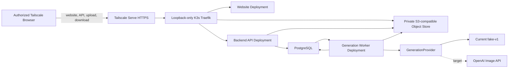

# AI Artist M1 High-Level Design

## Document Control

| Field | Value |
| --- | --- |
| Status | Active M1 target; fake-provider foundation implemented, OpenAI adapter pending |
| Owner | Codex |
| Product milestone | M1: `Memory Postcard Studio` |
| Primary source | Product direction only; the reconciled LLDs are authoritative for implementation contracts |
| Current design direction | Tailnet-only home K3s postcard generation; deterministic fake provider implemented first |

## 1. Executive Summary

M1 is a narrow website-first workflow. A user creates a `Task`, uploads 1 to 5 photos, and provides a title, note, and style. The system creates one or more immutable generation `Attempt`s, each with a complete input snapshot. Attempt 1 has no refinement note; every later Attempt requires one. Each successful Attempt produces exactly one `1800x1200` postcard PNG.

M1 proves the intake -> upload -> asynchronous generation -> status -> download loop on a home Linux server running a single-node K3s cluster. It is accessible only to approved devices in the owner's Tailscale tailnet through one canonical HTTPS hostname. The implemented foundation currently uses the deterministic fake provider. The target external-provider contract uses the OpenAI Image API without hosting a model on the home server, but that production adapter is not implemented yet. M1 intentionally does not implement a product pack, rights workflow, automated QA gate, packaging, accounts, payments, marketplace publishing, POD, NFT, email delivery, public Internet access, or high availability.

Implementation details and field-level contracts are owned by [LLD-00](../lld/milestone-1-lld-00-implementation-foundation.md), [LLD-01](../lld/milestone-1-lld-01-website-intake-status-delivery.md), [LLD-02](../lld/milestone-1-lld-02-backend-api-lifecycle.md), [LLD-03](../lld/milestone-1-lld-03-generation-worker.md), and [LLD-05](../lld/milestone-1-lld-05-runtime-security-ops.md). [LLD-04](../lld/milestone-1-lld-04-qa-packaging-delivery.md) is deferred.

## 2. M1 Decisions

| Decision | M1 Direction |
| --- | --- |
| Customer entry point | Website only |
| Base input | 1 to 5 JPEG/PNG photos, title, note, and style |
| Style catalog | First demo exposes `warm_handmade` |
| Domain container | `Task` |
| Generation execution | `Attempt` with a complete immutable snapshot |
| Refinement | Only `refinement_note` is mutable between Attempts |
| Output | One `1800x1200` `image/png` postcard per successful Attempt |
| Application stack | Next.js, React, and TypeScript frontend; Python FastAPI backend and Python Worker |
| Provider | Current: deterministic `fake-v1`; target: OpenAI Image API with `gpt-image-2-2026-04-21` after adapter readiness |
| Runtime | Single-node K3s on the approved home Linux server |
| Network exposure | Authorized Tailscale tailnet only through persistent Serve; no Funnel, public ingress, or router port forwarding |
| Async delivery | Queued Attempt rows in PostgreSQL; one claim and no automatic retry per Attempt |
| Customer access | Approved tailnet devices; no application login or Task token in Phase 1 |
| Data cleanup | No application-data cleanup, archive, or complex recovery in M1 |
| Attempt retention | No automatic cleanup |
| Availability | Single-node, best-effort; no HA requirement |

## 3. Goals And Non-Goals

### Goals

- Let a user create a draft Task before uploading photos.
- Accept 1 to 5 photos with title, note, and style.
- Upload photos directly to a private S3-compatible object store using short-lived backend-issued upload instructions.
- Create an Attempt only when the Task input is ready.
- Support refinement Attempts that change only `refinement_note`.
- Generate one postcard PNG asynchronously.
- Expose separate Task input status and Attempt generation status.
- Provide a private system-level Task center for asynchronous generation visibility.
- Allow the user to inspect Attempt history and download any ready postcard artifact.

### Non-Goals

- Rights or copyright assessment.
- Product packs, sticker sheets, posters, PDFs, ZIP files, manifests, or automated QA gates.
- Operator review, accounts, payments, subscriptions, or usage credits.
- Email delivery, marketplace publishing, Etsy, Shopify, POD, NFT, or fulfillment.
- Public galleries or a general-purpose image-generation playground.
- Application-data cleanup, archive tiers, or complex recovery workflows.
- Public DNS, Tailscale Funnel, public ingress, Internet-facing access, direct non-tailnet LAN access, multi-node Kubernetes, or high availability.
- Running OpenAI, Claude, or another foundation model on the home server.

## 4. User Experience

Core screens:

- `Start`: explain the postcard outcome and start a Task.
- `My Projects`: list every private-studio Task, its current Attempt status, and expandable Attempt history.
- `Guided Intake`: collect title, note, style, and 1 to 5 photos.
- `Generate`: show the immutable base inputs and start the first Attempt.
- `Status`: show Task status separately from current Attempt status.
- `Refine`: accept only a `refinement_note` after the current Attempt is `ready` or `failed`.
- `Delivery`: show artifact metadata and request a fresh download URL.

Task status:

- `draft`: Task exists but required input is incomplete.
- `uploading`: photo upload is in progress.
- `ready`: required input is complete and can generate.

Attempt status:

- `queued`: the Attempt is waiting for the Generation Worker to claim it from PostgreSQL.
- `generating`: the Generation Worker owns the Attempt.
- `ready`: postcard artifact is available.
- `failed`: generation failed; the failed Attempt is terminal and the user may create a new refinement Attempt.

## 5. System Context



Runtime responsibilities:

| Component | Responsibility |
| --- | --- |
| Tailscale Serve + loopback-only Traefik + Website Deployment | Serve the website only to approved tailnet clients without exposing Kubernetes ingress ports on the host network. |
| Backend API Deployment | Create Tasks, issue upload/download links, validate input, create queued Attempts, and return status. |
| PostgreSQL | Store the four normative tables; Attempt rows also provide the durable queue. |
| Private S3-compatible object store | Store source uploads and postcard artifacts on persistent storage. |
| Generation Worker Deployment | Claim queued Attempts and call the configured `GenerationProvider`; the current implementation uses in-process `fake-v1`, while a future OpenAI adapter will use outbound HTTPS. |
| Kubernetes/container logs | Provide basic runtime and failure visibility without a complex observability stack. |

## 6. Primary Runtime Flow

1. The browser lists existing Task summaries for `My Projects` or creates a draft Task and receives its `task_id`.
2. The user adds one or more JPEG/PNG photos; the browser requests slots for that batch and uploads directly to the private S3-compatible object store.
3. The browser confirms each upload; the backend validates stored object metadata. The user may repeat this step one photo or one batch at a time.
4. The user selects `Done adding photos`; the backend validates title, note, style, 1–5 uploaded Assets, and no pending slots, then sets the Task to `ready`.
5. `Generate` calls the common Attempt-creation endpoint and creates Attempt 1 with a complete immutable snapshot and status `queued`.
6. The backend atomically inserts the queued Attempt with fixed provider/model and updates `tasks.current_attempt_id` in PostgreSQL.
7. The Generation Worker claims the Attempt once, calls the configured provider once, normalizes the provider image to the fixed postcard dimensions, performs minimum output verification, writes Artifact metadata, and directly updates the Attempt to `ready` or `failed`. The implemented path uses `fake-v1`; the target OpenAI adapter remains pending.
8. The browser polls Task metadata or Attempt history.
9. For a ready Artifact, the backend returns only a short-lived presigned download URL.
10. A refinement calls the same Attempt-creation endpoint with only `refinement_note` and creates a later Attempt after no Attempt is `queued` or `generating`.

## 7. Data And Artifact Boundaries

### Task

A Task owns immutable base input: 1 to 5 photo asset references, title, note, style, Task status, and current Attempt reference.

### Attempt

An Attempt owns one complete snapshot of the Task input plus a nullable `refinement_note`: null for Attempt 1 and required for later Attempts. `attempt_id` is the only generation execution identity. M1 does not introduce `generation_job_id`, `generation_version`, or freshness identifiers.

### Artifact

Each successful Attempt owns one postcard Artifact:

```text
format: image/png
width: 1800
height: 1200
storage: tasks/{task_id}/attempts/{attempt_id}/postcard.png
```

Storage references remain internal. Customer APIs expose artifact metadata and, through the download endpoint, only a short-lived presigned URL.

## 8. Security And Runtime Constraints

- The website, API, and object-store upload/download endpoints are reachable only through `https://tongjin-server.tail910d5f.ts.net` from devices permitted by the tailnet policy.
- Tailscale Serve terminates HTTPS and proxies to loopback-only K3s Traefik; Tailscale Funnel, router port forwarding, UPnP, other public tunnels, and public load balancers are prohibited in Phase 1.
- Private object storage is not anonymously readable and uses persistent storage with host-level access restricted to the runtime administrator.
- The browser never chooses object keys.
- Phase 1 has no application-layer account, login, or Task-token authentication. Any device permitted by the tailnet policy can call the customer API and list every Task summary in the private studio.
- `task_id` is a resource identifier, not an authorization credential. Authentication and authorization must be added before any future public exposure.
- Uploads accept only JPEG/PNG, up to 20 MB per photo and 5 photos per Task.
- Upload and download URLs have a default TTL of 15 minutes.
- The current fake-provider runtime receives no AI-provider credential. A future `OPENAI_API_KEY` must be a server-side Kubernetes Secret available only to the Generation Worker and never committed or returned to the browser.
- External-provider operation will require outbound HTTPS; no AI model runs locally.
- The Generation Worker cannot issue customer download URLs or modify unrelated Tasks.
- Phase 1 uses one Kubernetes node and one replica per stateful or worker component; planned downtime and node failure are accepted.
- M1 does not implement application-data cleanup, archive, or complex recovery.

## 9. Deferred Scope

LLD-04 remains deferred. Future milestones may add automated visual QA, multi-artifact output, ZIP/PDF packaging, manifests, rights checks, and marketplace-facing delivery, but those features are not part of the M1 implementation path.

AWS remains a possible later deployment target if public access, managed durability, scaling, or higher availability becomes necessary. That migration must preserve the Task/Attempt/API and provider contracts while replacing runtime adapters; Phase 1 must not depend on AWS SDKs or AWS-specific identifiers in domain interfaces.

## 10. Implementation Readiness

The reconciled LLD set is the implementation source of truth:

1. LLD-00: Next.js/React/TypeScript frontend and Python backend foundation.
2. LLD-02: Task/Asset/Attempt persistence and customer APIs.
3. LLD-05: tailnet-only home K3s runtime, PostgreSQL, private object storage, single-delivery Attempt claiming, secrets, and security.
4. LLD-01: website intake, upload, status, refinement, and download UX.
5. LLD-03: implemented fake-provider generation plus the pending OpenAI target contract, normalization, and minimum verification.
6. End-to-end verification for one-photo, five-photo, refinement, terminal failure, and artifact download flows.
