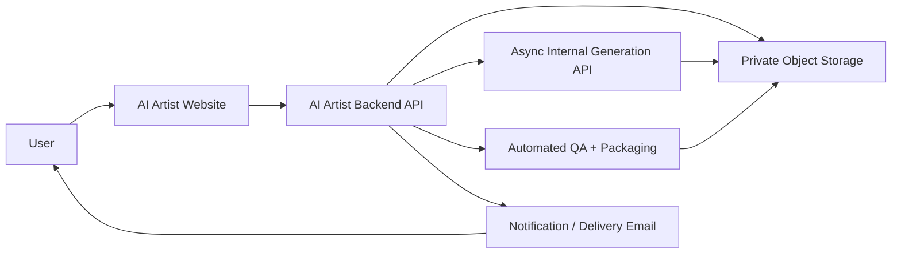
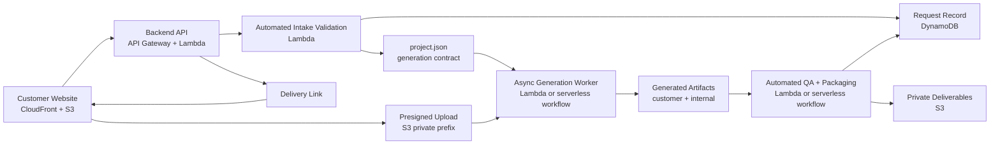

# AI Artist M1 High Level Design

## Document Control

| Field | Value |
| --- | --- |
| Status | Draft for review |
| Owner | Codex |
| Product milestone | M1: `Memory Product Pack Agent` |
| Primary source | [Milestone 1 PRFAQ](../prfaq/milestone-1-scope.md), narrowed by subsequent HLD decisions |
| Current design direction | Website-integrated, fully automated artifact generation |
| Explicitly not covered | Detailed product spec, API spec, field-level schema, implementation tasks, launch copy |

## 1. Executive Summary

M1 is a website-first creative product generator. A user provides 1 to 5 rights-owned travel photos, notes, style choices, usage intent, and output metadata. The system validates the input, generates a travel-memory product pack, runs automated quality checks, packages the deliverables, and makes `final_download_pack.zip` available for download.

The first version should prove the core artifact-generation loop before adding payment, subscriptions, operator review, marketplace integrations, POD, NFT, or a broader creator platform.

## 2. Design Decisions

| Decision | M1 Direction | Rationale |
| --- | --- | --- |
| Customer entry point | Website only | Target users are non-technical and need a guided UI. |
| Generation path | Website/API-triggered automated generation | User input should produce artifacts directly without manual production steps. |
| Review model | No required operator review | The first version optimizes for core function and fast validation. |
| Payment model | No payment in M1 core | Prove users can create and value the artifacts before adding checkout complexity. |
| Execution model | Async generation and packaging | Website submit should return status quickly; artifact generation should continue outside the request-response path. |
| Product niche | `travel_memory_cards` | Narrow scope, clear inputs, lower IP risk than celebrity/fan/logo-heavy workflows. |
| Publishing | Artifact download only | No Etsy, Shopify, POD, NFT, fulfillment, listing draft, or buyer messaging side effects. |
| Platform scope | No full SaaS platform | Avoid accounts, dashboards, public galleries, subscriptions, and marketplace features until the core loop works. |

## 3. Decision Delta From PRFAQ

This HLD intentionally narrows the PRFAQ into the first core implementation slice. Follow-up milestones can close the remaining PRFAQ gaps after the artifact-generation loop works.

| PRFAQ Assumption | Current HLD Direction |
| --- | --- |
| Pack-based pricing and paid validation | No payment or checkout in M1 core. |
| Operator workflow / human QA | Fully automated validation, generation, QA, packaging, and delivery. |
| Local CLI generation | Website/API-triggered internal Generation API. |
| Seller Pack and revision promise | Deferred until after core generation is validated. |
| Etsy/listing-facing materials | Non-core follow-up; M1 core focuses on art artifacts. |
| Paid-user success metric | Core validation is successful artifact generation from website inputs. |

## 4. Goals And Non-Goals

### Goals

- Let a non-technical user complete website intake without help.
- Accept 1 to 5 travel, city walk, or lifestyle photos plus notes, style choice, usage intent, and output metadata.
- Generate customer-facing art artifacts automatically through website/API-triggered asynchronous generation.
- Package deliverables into `final_download_pack.zip`.
- Keep uploaded photos and generated deliverables private.
- Record automated rights status as `ready`, `needs_customer_input`, or `blocked`.
- Record automated quality results in internal artifacts such as `manifest.json` and `quality_report.json`.
- Provide clear customer status for generation, delivery, blocked, and failed states.

### M1 Acceptance Criteria

- A user can submit 1 to 5 valid photos, notes, style choice, usage intent, rights answers, and output metadata from the website.
- The backend starts asynchronous generation and returns a trackable request status.
- The system generates all core art artifacts for at least 3 to 5 demo requests without operator intervention.
- Automated QA and packaging produce `final_download_pack.zip`.
- The user can download the generated pack from a delivery link.
- Requests that cannot generate artifacts move to `needs_customer_input`, `blocked`, or `failed` with a customer-readable reason.

### Non-Goals

- Payment, checkout, pricing tiers, paid plans, subscriptions, or usage credits.
- Required operator review or manual production gate.
- Native mobile app.
- Full SaaS accounts, public dashboard, public gallery, creator marketplace, or cloud asset library.
- Etsy, Shopify, POD, NFT, fulfillment, buyer messaging, or auto-publishing integrations.
- `listing_kit`, Etsy listing copy, and Etsy-facing listing preview as core M1 deliverables.
- Pet, portrait, fan art, celebrity, fictional character, logo-heavy, or unclear-rights workflows.
- General-purpose image generation playground.
- Detailed API endpoints, field-level schemas, or implementation tasks.

## 5. Users And Experience

### Primary User

The M1 user has travel or lifestyle photos and wants a finished creative pack without learning design tools. The first version serves personal download, gifting, social sharing, and draft digital-product exploration.

### Website Experience

The website should feel like a focused creative product generator, not an AI playground. It should make the final pack tangible before asking for user effort.

Core screens:

- `Start`: product outcome, owned/demo style examples, rights expectations, and direct start action.
- `Guided Intake`: photo upload, travel notes, style choice, usage intent, rights checklist, and output metadata.
- `Review And Submit`: concise request summary, selected style/output metadata, rights status, and delivery expectation.
- `Status`: `submitted`, `validating`, `generating`, `qa_checking`, `packaging`, `delivered`, `needs_customer_input`, `blocked`, or `failed`.
- `Delivery`: download link and included art artifact file list.
- `Support`: download issue, failed generation, or input clarification only.

Experience principles:

- Use visual examples to make the generated pack easy to understand.
- Keep each intake step focused on one decision.
- Make rights confirmation direct and trustworthy without presenting legal advice.
- Explain `needs_customer_input`, `blocked`, and `failed` states as recoverable product states where possible.
- Do not make marketplace income claims.

## 6. System Context

The user only interacts with the website and delivery link. Backend services handle validation, generation, QA, packaging, and delivery orchestration.

## 7. Serverless Runtime Architecture

This section uses `Runtime Component` because M1 should primarily run on serverless AWS services such as `CloudFront`, `S3`, `API Gateway`, `Lambda`, `DynamoDB`, `SES`, and `CloudWatch`.

Runtime responsibilities:

| Runtime Component | Likely M1 Service | Responsibility |
| --- | --- | --- |
| Customer Website | `CloudFront + S3` | Guided intake, upload flow, status, delivery UX. |
| Backend API | `API Gateway + Lambda` | Request creation, presigned upload, validation orchestration, lifecycle updates, generation trigger, delivery links. |
| Private Object Storage | `S3` | Source photos, generation inputs, internal artifacts, final deliverables. |
| Request Record | `DynamoDB` | Durable request lifecycle, rights state, selected output metadata, delivery references. |
| Async Generation Worker | `Lambda` async invocation, `SQS`, or `Step Functions` | Generate customer-facing artifacts and internal generation artifacts from `project.json` and uploaded photos. |
| Automated QA + Packaging | `Lambda`, `SQS`, or `Step Functions` | Check dimensions, naming, file size, readability basics, visible artifacts, and package outputs. |
| Notification / Delivery | `SES` if email delivery is used | Submission confirmation, clarification, failure, and delivery email. |

## 8. Primary Runtime Flow

1. User opens the website and reviews style examples.
2. User uploads 1 to 5 photos through presigned upload.
3. User enters travel notes, usage intent, style choice, rights answers, and output metadata.
4. Website submits the request to the Backend API.
5. Backend API validates photo count, request completeness, travel-memory fit, and rights answers.
6. Backend API assigns `ready`, `needs_customer_input`, or `blocked`.
7. If hard gates pass, Backend API creates `project.json` and starts asynchronous generation.
8. Async Generation Worker creates customer-facing art artifacts plus internal artifacts.
9. Automated QA + Packaging checks outputs and creates `final_download_pack.zip`.
10. Backend API updates lifecycle state and issues a delivery link.
11. User downloads the final pack or sees a customer-readable blocked/failed reason.

## 9. Data And Artifact Boundaries

### User Inputs

- 1 to 5 uploaded source photos.
- Travel notes.
- Style direction.
- Usage intent.
- Rights checklist answers.
- Output metadata for the core pack.

### `project.json`

`project.json` is the internal contract created automatically from submitted intake data before calling the Generation API. It should reference:

- version and request identity
- product niche
- selected style direction
- usage intent and travel notes
- uploaded asset references
- rights answers and rights status
- intended output targets

It should not contain secrets. Personally identifying information should be minimized and referenced through request metadata where possible.

### Core Customer Deliverables

- `final_download_pack.zip`
- `sticker_sheet.png`
- `sticker_sheet.pdf`
- `postcard.png`
- `postcard.pdf`
- `poster.png`
- `poster.pdf`
- `social_preview.png`

### Follow-Up / Non-Core Deliverables

- `listing_preview.png`
- `listing_kit.md` or `listing_kit.pdf`
- `buyer_usage_note.md`

### Internal Artifacts

- `manifest.json`
- `quality_report.json`
- `rights_checklist.json`
- `prompt_log.md` or `prompt_log.json`
- `generation_notes.md`

Internal artifacts are not default customer deliverables. A future paid or seller-focused version may expose a curated quality summary, but raw prompt logs and internal notes should remain internal unless explicitly approved.

## 10. Request Lifecycle

| State | Meaning |
| --- | --- |
| `draft` | Intake exists locally or client-side but is not submitted. |
| `uploading` | Request exists and upload URLs are active. |
| `submitted` | User completed intake and submitted. |
| `validating` | Backend is checking photo count, travel-memory fit, usage intent, rights answers, and `project.json` readiness. |
| `needs_customer_input` | Customer must clarify or replace input. |
| `blocked` | Request cannot proceed under M1 rights or scope guardrails. |
| `generating` | Async Generation Worker is producing artifacts. |
| `qa_checking` | Generated output files and checklist are being checked automatically. |
| `packaging` | System-approved artifacts are being packaged into `final_download_pack.zip`. |
| `delivered` | Final pack is ready and delivery link was issued. |
| `failed` | Generation, QA, or packaging failed and the user should retry or adjust input. |
| `archived` | Request is no longer active. |

Customer-facing labels can be simpler than internal states, but lifecycle should be explicit and metadata-driven. The system should not infer state only from file existence.

## 11. AWS Service Choices

| AWS Service | M1 Use |
| --- | --- |
| `CloudFront + S3` | Host static website and public static assets. |
| `API Gateway + Lambda` | Intake submission, upload URL generation, validation orchestration, generation trigger, status lookup, delivery-link creation. |
| `SQS` or `Step Functions` | Async generation and packaging orchestration when Lambda async invocation is not enough. |
| `S3` | Private source uploads, generation input bundles, internal QA artifacts, final download packs. |
| `DynamoDB` | Request lifecycle metadata, rights state, selected output metadata, delivery references. |
| `SES` | Submission confirmation, clarification, failure, and delivery email if email delivery is used. |
| `CloudWatch` | Logs, errors, alarms, and basic operational visibility. |

Deferred unless needed:

- `Cognito`: avoid customer accounts in M1 unless request-link delivery is not safe enough.
- `ECS`, `Fargate`: defer unless generation or packaging outgrows serverless execution limits.
- `RDS`: not needed for M1 request metadata.

## 12. Quality, Privacy, And Safety

Quality gates:

- Output dimensions are present and match intended targets.
- File names are customer-readable and marketplace-safe.
- File sizes are within intended delivery limits.
- Text is readable enough for the target artifact.
- Obvious visual artifacts, watermarks, and signatures are flagged.
- `manifest.json` and `quality_report.json` are written for every completed request.

Privacy and security:

- Store uploads and deliverables in private S3 prefixes.
- Use short-lived presigned upload and download links.
- Encrypt S3 objects at rest.
- Avoid public bucket paths for source photos and deliverables.
- Keep raw photos, generated packs, and internal artifacts separated by request and version.
- Define retention and cleanup before wider testing.

Rights and marketplace safety:

- Require rights confirmation before generation.
- Route logo, celebrity, fan art, unclear ownership, and commercial-risk inputs to `needs_customer_input` or `blocked`.
- Present compliance output as a risk checklist, not legal advice.
- Verify current Etsy rules before any launch-facing marketplace claims.

## 13. Extensibility Posture

M1 should avoid platform overbuild while preserving future options:

- Keep `project.json` and `manifest.json` stable as boundaries between intake, generation, QA, and delivery.
- Keep model/provider-specific AI calls behind the async Generation Worker.
- Version deliverables by request and revision. Do not overwrite delivered packs in place.
- Treat marketplace, POD, NFT, payment, and account features as future adapters around generated pack artifacts.
- Keep publishing side effects outside M1.
- Allow the generation and packaging flow to move later from serverless async execution to `ECS/Fargate` without changing the customer journey.

## 14. Risks And Mitigations

| Risk | Mitigation |
| --- | --- |
| Users may not value generated packs | Make M1 free and focus validation on whether core art artifacts can be generated successfully from website inputs. |
| Output quality may not meet gifting, social, or listing expectations | Use constrained style choices, fixed output targets, and automated file/readability checks. |
| Automated generation may produce bad artifacts | Record `quality_report.json`, expose `failed` states, and keep the first version narrow. |
| No operator review may let edge cases through | Use conservative automated gates: `needs_customer_input`, `blocked`, or `failed` before delivery. |
| Rights checklist may be mistaken for legal clearance | Use conservative `needs_customer_input` / `blocked` states and label compliance output as checklist-only. |
| Uploaded photos or deliverables may leak | Use private storage, short-lived links, encryption, and retention cleanup. |
| Marketplace guidance may drift | Keep listing materials out of M1 core and verify official marketplace rules before launch-facing copy or real listing guidance. |
| Scope may expand into a platform too early | Keep payment, accounts, publishing, POD, NFT, and public gallery out of M1. |

## 15. Open Questions

- Should delivery use email plus request link, or request link only?
- What retention period should apply to source photos, generated outputs, and internal artifacts?
- What generation time should M1 promise or show in status?
- Are all demo style examples owned, licensed, or generated from safe source material?
- What happens when a free request is `blocked` or `failed`: retry, replace input, or support contact?
- Which artifact-quality failures should block delivery versus appear as warnings?
- Which marketplace-policy checks must be verified before showing Etsy-facing guidance?

## 16. Next Artifacts

After HLD approval, create these narrower follow-up artifacts:

1. Website intake wireframe and customer-facing copy.
2. `project.json` schema and request lifecycle contract.
3. Internal Generation API contract for generating a pack.
4. Automated QA and delivery packaging flow.
5. Sample output pack using fake, owned, or licensed demo photos.

These artifacts should remain narrower than a full SaaS spec until M1 validates that users can complete intake and value the delivered pack.
