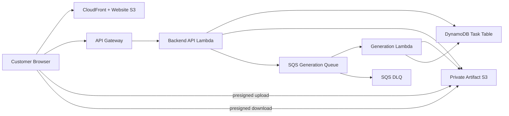

# AI Artist M1 High-Level Design

## Document Control

| Field | Value |
| --- | --- |
| Status | Implementation-ready M1 scope; detailed contracts live in the LLD set |
| Owner | Codex |
| Product milestone | M1: `Memory Product Pack Agent` |
| Primary source | Product direction only; the reconciled LLDs are authoritative for implementation contracts |
| Current design direction | Website-integrated postcard artifact generation |

## 1. Executive Summary

M1 is a narrow website-first workflow. A user creates a `Task`, uploads 1 to 5 photos, and provides a title, note, and style. The system creates one or more immutable generation `Attempt`s, each with a complete input snapshot and an optional refinement note. Each successful Attempt produces exactly one `1800x1200` postcard PNG.

M1 proves the intake -> upload -> asynchronous generation -> status -> download loop. It intentionally does not implement a product pack, rights workflow, automated QA gate, packaging, accounts, payments, marketplace publishing, POD, NFT, or email delivery.

Implementation details and field-level contracts are owned by [LLD-01](../lld/milestone-1-lld-01-website-intake-status-delivery.md), [LLD-02](../lld/milestone-1-lld-02-backend-api-lifecycle.md), [LLD-03](../lld/milestone-1-lld-03-generation-worker.md), and [LLD-05](../lld/milestone-1-lld-05-runtime-security-ops.md). [LLD-04](../lld/milestone-1-lld-04-qa-packaging-delivery.md) is deferred.

## 2. M1 Decisions

| Decision | M1 Direction |
| --- | --- |
| Customer entry point | Website only |
| Base input | 1 to 5 JPEG/PNG photos, title, note, and style |
| Style catalog | First demo exposes `warm_handmade` |
| Domain container | `Task` |
| Generation execution | `Attempt` with a complete immutable snapshot |
| Refinement | Only `refinement_note` is mutable between Attempts |
| Output | One `1800x1200` `image/png` postcard per successful Attempt |
| Provider | Deterministic fake provider for M1 |
| Async delivery | SQS generation queue, Generation Lambda, and DLQ |
| Customer access | Task-link bearer token, valid for 30 days |
| Data cleanup | No application-data cleanup, archive, or complex recovery in M1 |
| DLQ retention | 14 days |

## 3. Goals And Non-Goals

### Goals

- Let a user create a draft Task before uploading photos.
- Accept 1 to 5 photos with title, note, and style.
- Upload photos directly to private S3 using short-lived backend-issued upload instructions.
- Create an Attempt only when the Task input is ready.
- Support refinement Attempts that change only `refinement_note`.
- Generate one postcard PNG asynchronously.
- Expose separate Task input status and Attempt generation status.
- Allow the user to inspect Attempt history and download any ready postcard artifact.

### Non-Goals

- Rights or copyright assessment.
- Product packs, sticker sheets, posters, PDFs, ZIP files, manifests, or automated QA gates.
- Operator review, accounts, payments, subscriptions, or usage credits.
- Email delivery, marketplace publishing, Etsy, Shopify, POD, NFT, or fulfillment.
- Public galleries or a general-purpose image-generation playground.
- Application-data cleanup, archive tiers, or complex recovery workflows.

## 4. User Experience

Core screens:

- `Start`: explain the postcard outcome and start a Task.
- `Guided Intake`: collect title, note, style, and 1 to 5 photos.
- `Generate`: show the immutable base inputs and start the first Attempt.
- `Status`: show Task status separately from current Attempt status.
- `Refine`: accept only a `refinement_note` after the current Attempt is `ready` or `failed`.
- `Delivery`: show artifact metadata and request a fresh download URL.

Task status:

- `draft`: Task exists but required input is incomplete.
- `uploading`: photo upload is in progress.
- `ready`: required input is complete and can generate.

Attempt status:

- `queued`: generation command is waiting in SQS.
- `generating`: Generation Lambda owns the Attempt.
- `ready`: postcard artifact is available.
- `failed`: generation failed and a retry/refinement is available.

## 5. System Context



Runtime responsibilities:

| Component | Responsibility |
| --- | --- |
| CloudFront + S3 | Host the website and approved public style assets. |
| API Gateway + Backend Lambda | Create Tasks, issue upload/download links, validate input, create Attempts, return status, and send SQS commands. |
| DynamoDB | Store Task, Asset, Attempt, and Artifact metadata. |
| Private S3 | Store source uploads, Attempt snapshots, and postcard artifacts. |
| SQS + Generation Lambda | Deliver and execute asynchronous generation commands. |
| SQS DLQ | Retain failed generation commands for 14 days. |
| CloudWatch | Basic logs and error visibility without complex dashboards. |

## 6. Primary Runtime Flow

1. The browser creates a draft Task and receives a one-time raw Task token.
2. The user adds one or more JPEG/PNG photos; the browser requests slots for that batch and uploads directly to private S3.
3. The browser confirms each upload; the backend validates stored object metadata. The user may repeat this step one photo or one batch at a time.
4. The user selects `Done adding photos`; the backend validates title, note, style, 1–5 uploaded Assets, and no pending slots, then sets the Task to `ready`.
5. `Generate` creates Attempt 1 with a complete immutable snapshot and status `queued`.
6. The backend sends `StartGenerationCommand` to SQS.
7. Generation Lambda claims the Attempt, generates the postcard, performs minimum output verification, writes Artifact metadata, and directly updates the Attempt to `ready` or `failed`.
8. The browser polls Task metadata or Attempt history.
9. For a ready Artifact, the backend returns only a short-lived presigned download URL.
10. A refinement submits only `refinement_note` and creates a later Attempt after no Attempt is `queued` or `generating`.

## 7. Data And Artifact Boundaries

### Task

A Task owns immutable base input: 1 to 5 photo asset references, title, note, style, Task status, and current Attempt reference.

### Attempt

An Attempt owns one complete snapshot of the Task input plus `refinement_note`. `attempt_id` is the only generation execution identity. M1 does not introduce `generation_job_id`, `generation_version`, or freshness identifiers.

### Artifact

Each successful Attempt owns one postcard Artifact:

```text
format: image/png
width: 1800
height: 1200
storage: tasks/{task_id}/attempts/{attempt_id}/postcard.png
```

Storage references remain internal. Customer APIs expose artifact metadata and, through the download endpoint, only a short-lived presigned URL.

## 8. Security And Runtime Constraints

- Private S3 buckets use Block Public Access, ACLs disabled, and default encryption.
- The browser never chooses S3 object keys.
- Task-scoped APIs require the Task bearer token; the token is valid for 30 days from Task creation.
- Tokens are sent only in the `Authorization` header and are never logged or accepted in query strings, paths, cookies, or request bodies.
- Uploads accept only JPEG/PNG, up to 20 MB per photo and 5 photos per Task.
- Upload and download URLs have a default TTL of 15 minutes.
- Generation Lambda cannot issue customer download URLs or modify unrelated Tasks.
- M1 does not implement application-data cleanup, archive, or complex recovery.

## 9. Deferred Scope

LLD-04 remains deferred. Future milestones may add automated visual QA, multi-artifact output, ZIP/PDF packaging, manifests, rights checks, and marketplace-facing delivery, but those features are not part of the M1 implementation path.

## 10. Implementation Readiness

The reconciled LLD set is the implementation source of truth:

1. LLD-02: Task/Asset/Attempt persistence and customer APIs.
2. LLD-05: AWS runtime, private storage, SQS, DLQ, and security.
3. LLD-01: website intake, upload, status, refinement, and download UX.
4. LLD-03: deterministic fake-provider generation and minimum verification.
5. End-to-end verification for one-photo, five-photo, refinement, failure, redelivery, and artifact download flows.
