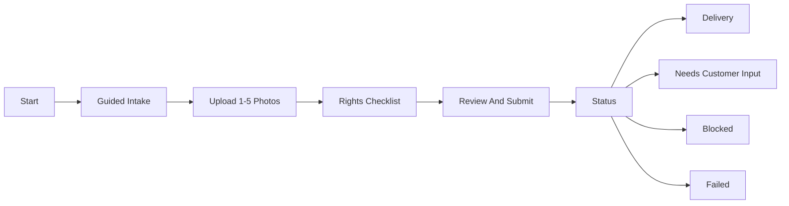

# AI Artist M1 LLD-01: Website Intake, Status, and Delivery UX

## Document Control

| Field | Value |
| --- | --- |
| LLD | LLD-01 |
| Product milestone | M1: `Memory Product Pack Agent` |
| Primary source | [M1 HLD](../hld/milestone-1-high-level-design.md) |
| Status | Reviewer reconfirmed signoff |
| Scope owner | Customer website intake, upload UX, status UX, delivery UX, and customer-safe copy |

## Purpose

LLD-01 defines the customer-facing website flow for M1. The website guides a non-technical user from product understanding through intake, upload, submission, status tracking, and final pack download.

The website is not a marketplace, account portal, operator dashboard, or generic image-generation playground. It is a focused creative product generator for travel-memory packs.

## In Scope

- Public product-start page.
- Guided intake for 1 to 5 photos.
- Upload UI using backend-issued upload slots.
- Travel notes, style choice, usage intent, rights checklist, and output metadata collection.
- Review and submit screen.
- Request status screen.
- Delivery screen for `final_download_pack.zip`.
- Customer-safe copy for `needs_customer_input`, `blocked`, `failed`, and `delivered`.
- Optional email-assisted status-link UX if LLD-02/05 enable email.

## Out Of Scope

- Accounts, login, dashboards, or public galleries.
- Payment, checkout, subscriptions, or usage credits.
- Marketplace publishing, listing drafts, POD, NFT, fulfillment, or buyer messaging.
- Operator review UI.
- Exposing internal artifacts.
- Direct customer control over S3 object keys, attempt IDs, or runtime prefixes.

## Primary User Flow



## Screens

### Start

Goals:

- Show the concrete M1 output: sticker sheet, postcard, poster, and social preview.
- Set rights expectations before upload.
- Avoid marketplace income claims.
- Avoid paid-plan or seller-pack language in M1 core.

Customer-visible artifact list:

- `sticker_sheet.png`
- `sticker_sheet.pdf`
- `postcard.png`
- `postcard.pdf`
- `poster.png`
- `poster.pdf`
- `social_preview.png`
- `final_download_pack.zip`

### Guided Intake

Required fields:

| Field | Purpose |
| --- | --- |
| `photos` | 1 to 5 user-owned or user-permitted photos. |
| `travel_notes.location_label` | Customer-readable location or memory label. |
| `travel_notes.memory_notes` | Short notes that guide style and captions. |
| `style.style_id` | M1-approved visual direction. |
| `usage_intent.primary` | Personal gift, social share, or draft digital-product exploration. |
| `rights` | Checklist answers used by LLD-02 validation. |
| `output_metadata` | Customer-friendly output preferences within M1 limits. |

The UI may mirror backend constraints but must treat LLD-02 validation as authoritative.

### Upload

The browser must never choose storage keys. The upload UI receives upload slots from LLD-02 and uploads directly through short-lived presigned POST or equivalent URLs.

UX requirements:

- Show per-photo upload progress.
- Show accepted media types and size limits from public config.
- Expire stale upload slots gracefully.
- Let the user retry a failed upload with a fresh backend-issued slot.
- Do not expose private bucket names, object keys, signed URL query strings, or request tokens.

### Review And Submit

The review screen shows:

- Photo count.
- Style label.
- Travel-memory notes summary.
- Rights checklist summary.
- Expected M1 output list.

The review screen must not:

- Promise marketplace readiness.
- Promise income or sales.
- Mention internal artifacts as customer deliverables.
- Show raw S3 keys or attempt metadata.

### Status

The UI maps internal lifecycle states to customer-safe labels.

| Internal state | Customer behavior |
| --- | --- |
| `draft` | Local intake has not been submitted. |
| `uploading` | Uploads are in progress or upload slots are active. |
| `submitted` | Request received. |
| `validating` | Inputs and rights checklist are being checked. |
| `needs_customer_input` | Ask for clarification or replacement where supported. |
| `blocked` | Explain that M1 cannot process the request under rights or scope guardrails. |
| `generating` | Creative pack is being generated. |
| `qa_checking` | Generated files are being checked. |
| `packaging` | Final download pack is being prepared. |
| `delivered` | Download is available. |
| `failed` | Technical failure or retry/support path. |
| `archived` | Request is no longer downloadable. |

The UI should not expose:

- `manifest.json`.
- `quality_report.json`.
- `rights_checklist.json`.
- `generation_manifest.json`.
- Prompt logs.
- Generation notes.
- Stack traces.
- Raw failure payloads.
- S3 keys.

### Delivery

The delivery screen requests a fresh download URL from LLD-02 when the request is `delivered`.

Rules:

- Display package name: `final_download_pack.zip`.
- Display the customer artifact list.
- Refresh expired download links through the status/download API.
- Do not place raw presigned URLs in copy, logs, or emails.
- Do not expose internal artifacts.

## Request-Link Security UX

Default delivery is request-link-only.

The request link format is:

```text
https://app.example.com/request/{request_id}#access_token={request_access_token}
```

The frontend extracts the URL fragment and sends the token only in:

```http
Authorization: Bearer <request_access_token>
```

Rules:

- Prefer in-memory token storage.
- `sessionStorage` is allowed only to survive refresh.
- `localStorage` is not allowed.
- Do not put tokens in query strings, paths, cookies, analytics, or visible support copy.
- If optional email is disabled and the link is lost, the customer must start a new request.
- If optional email recovery is enabled, recovery semantics are owned by LLD-02/05 and must avoid enumeration.

## Customer-Safe Copy Rules

`needs_customer_input`:

- Explain what the customer can fix.
- If amendment is supported, guide the customer to replace files or clarify inputs.
- If amendment is not supported, guide the customer to start a new request.

`blocked`:

- Explain M1 rights/scope guardrails.
- Avoid legal conclusions.
- Do not offer manual override.

`failed`:

- Present as a technical issue or retry path.
- Avoid stack traces.
- Do not expose provider internals.

`delivered`:

- Show download availability and included file list.
- Avoid public bucket language.

## Dependencies

LLD-01 depends on:

- LLD-02 for request creation, upload slots, status API, token validation, lifecycle states, and download-link API.
- LLD-04 for final package metadata and customer-safe delivery readiness.
- LLD-05 for request-link constraints, public runtime config, no-store/cache/referrer policy requirements, and optional email enablement.

LLD-01 provides:

- Customer-facing labels and state expectations.
- UX constraints for upload retry and download refresh.
- Copy boundaries for rights, failed, blocked, and delivered states.

## Acceptance Checks

- A user can complete intake with 1 to 5 valid photos.
- The UI submits only M1-supported fields.
- The UI does not expose internal artifacts or private storage details.
- Request tokens use fragment-to-Authorization-header transport.
- Status screens cover all HLD lifecycle states.
- Delivery uses a fresh short-lived download URL.
- The UI does not introduce accounts, payment, marketplace publishing, POD, NFT, public gallery, or operator review.
- Customer-visible copy treats compliance as a risk checklist, not legal advice.

## Open Questions

- Should optional SES email be enabled for demo or deferred?
- What exact public domain and route structure should demo use?
- Should warning-only QA results ever appear as curated customer copy?
- What support route is used for failed or expired downloads?
