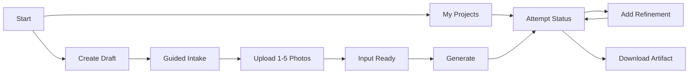

# AI Artist M1 LLD-01: Website Intake, Status, and Delivery UX

## Document Control

| Field | Value |
| --- | --- |
| LLD | LLD-01 |
| Product milestone | M1: `Memory Product Pack Agent` |
| Primary source | [M1 HLD](../hld/milestone-1-high-level-design.md) |
| Status | Implementation-ready; UX and access contracts finalized |
| Scope owner | Customer website intake, upload UX, status UX, refinement UX, and artifact delivery |

## Purpose

LLD-01 defines the customer-facing website flow for creating a postcard-style artifact from 1 to 5 photos and a small set of creative inputs.

The website is not a marketplace, account portal, operator dashboard, or generic image-generation playground.

## In Scope

- Tailnet-accessible product-start page.
- System-level `My projects` task center for the private studio.
- Draft task creation before upload.
- Guided intake for 1 to 5 photos.
- Upload UI using backend-issued upload slots.
- `title`, `note`, and `style` collection.
- Attempt creation for both initial generation and later refinement through one API endpoint.
- Task input status and current attempt status.
- Attempt history view.
- Delivery of a fixed-dimension postcard PNG artifact.

## Out Of Scope

- Accounts, login, account-scoped dashboards, or public galleries.
- Payment, checkout, subscriptions, or usage credits.
- Rights, copyright, or license workflows in this first version.
- Marketplace publishing, listing drafts, POD, NFT, fulfillment, or buyer messaging.
- Operator review UI.
- Exposing internal artifacts or storage references.
- Direct customer control over object-store keys, attempt IDs, or runtime prefixes.

## Primary User Flow



## Screens

### Start

Goals:

- Show the concrete M1 output: a postcard-style PNG.
- Explain that users provide photos, title, note, and style.
- Avoid marketplace income claims and seller-pack language.

Customer-visible artifact:

- One fixed-dimension postcard PNG.

### My Projects

The `/tasks` route is the system-level activity center for the private studio. It lists every Task visible inside the Phase 1 tailnet boundary, ordered by latest activity.

Each Task row shows:

- Task title or an `Untitled postcard` fallback.
- Task input status.
- Current Attempt number and status, or `Not started`.
- Uploaded photo count, total Attempt count, and latest activity time.
- An `Open project` action.
- An expandable Attempt-history region loaded from `GET /v1/tasks/{task_id}/attempts`.

The first page loads from `GET /v1/tasks`. Additional pages use the returned cursor. Full Attempt history is loaded only when a Task is expanded; the collection response does not include photos, the creative note, refinement notes, artifacts, or provider metadata.

While a visible Task has a `queued` or `generating` current Attempt, the page refreshes that Task's status automatically. Manual collection refresh remains available. Ready artifacts may be downloaded from an expanded Attempt by requesting a fresh download URL through the existing artifact API.

### Guided Intake

Required fields:

| Field | Purpose |
| --- | --- |
| `photos` | 1 to 5 uploaded photos. |
| `title` | Customer-provided artifact title. |
| `note` | Customer-provided creative note. |
| `style` | M1-approved visual direction. |

The first demo exposes one style ID: `warm_handmade`.

The UI saves title, note, and style through `PATCH /v1/tasks/{task_id}`. It may mirror backend constraints but must treat LLD-02 validation as authoritative. The UI uses `title` 1–120 characters, `note` 1–1000 characters, and the fixed style `warm_handmade`. Once the task is `ready`, these base inputs and the photo set are immutable.

### Upload

The browser requests upload slots from LLD-02 and uploads directly through short-lived presigned POST or equivalent URLs.

UX requirements:

- Show per-photo upload progress.
- Accept only JPEG and PNG photos, up to 20 MB per photo and 5 photos per Task.
- Let the user add one photo or a batch of photos through the file picker; do not ask for the final photo count first.
- Request upload slots with a per-file manifest containing `client_file_id`, `filename`, `media_type`, and `size_bytes`, plus a new batch-level `idempotency_key`; reuse the exact manifest and key if the HTTP request is retried.
- Map each response slot back to the selected browser file through `client_file_id`, not filename or array position alone.
- Disable `Add photo` when 5 photos are uploaded or pending.
- Keep the Task in `uploading` while the user is adding photos.
- Provide a `Done adding photos` action that calls the complete-intake API.
- Expire stale upload slots gracefully.
- Let the user retry a failed upload with a fresh backend-issued slot.
- Do not expose private bucket names, object keys, or signed URL query strings.

### Generate And Refine

The Generate screen is available after complete-intake succeeds and the Task is `ready`. It shows:

- Photo count.
- Title, note, and style.
- Expected fixed-dimension postcard PNG output.

Both actions call `POST /v1/tasks/{task_id}/attempts`. The first `Generate` action sends `{}` and creates Attempt 1. A later refinement sends only `refinement_note` and creates a new Attempt after the current Attempt is `ready` or `failed`.

Only one attempt may be `queued` or `generating` for a task at a time.

### Status

The UI displays task input status separately from current attempt status.

Task status:

| Status | Customer behavior |
| --- | --- |
| `draft` | Required text fields or photos are incomplete. |
| `uploading` | Photos are being uploaded or the user can still add photos before completing intake. |
| `ready` | Input is complete and can generate or refine. |

Attempt status:

| Status | Customer behavior |
| --- | --- |
| `queued` | Generation is waiting to start. |
| `generating` | Postcard artifact is being generated. |
| `ready` | Artifact is available. |
| `failed` | Generation failed and this Attempt is terminal; a new refinement Attempt may be created. |

The UI may display attempt history from `GET /v1/tasks/{task_id}/attempts`. The current attempt is shown by default; previous ready artifacts remain downloadable.

The UI must not expose:

- Object-store keys or bucket names.
- Presigned URL internals.
- Prompt logs, provider errors, or stack traces.
- Internal generation or operational metadata.

### Delivery

The delivery screen requests a fresh download URL for a ready postcard artifact.

Rules:

- Display the artifact filename and dimensions.
- Refresh expired download links through the artifact download API.
- Do not place raw presigned URLs in copy, logs, or emails.

## Phase 1 Tailscale Access UX

Phase 1 relies on approved Tailscale tailnet access and has no application-layer login or Task token. Home and remote clients use the same canonical URL.

The Task route is:

```text
https://tongjin-server.tail910d5f.ts.net/tasks/{task_id}
```

The Task-center route is:

```text
https://tongjin-server.tail910d5f.ts.net/tasks
```

Rules:

- The frontend does not implement login, token storage, or an `Authorization` header.
- Any device permitted by the tailnet policy with a Task URL can open that Task.
- Any device permitted by the tailnet policy can open `My projects` and see every Task summary in this studio. Phase 1 is therefore appropriate only for a trusted single-household tailnet.
- `task_id` is a resource identifier, not an authorization credential.
- Tailscale Funnel and other public exposure are prohibited until authentication and authorization are designed.

## Customer-Safe Copy Rules

`failed`:

- Present the issue as a terminal technical failure for this Attempt and offer a new refinement Attempt.
- Avoid stack traces and provider internals.

`ready`:

- Show artifact availability and the download action.
- Avoid public bucket language.

## Dependencies

LLD-01 depends on:

- LLD-02 for the Task collection, task creation, upload slots, input validation, task status, attempt creation, status metadata, attempt history, and artifact download links.
- LLD-03 for artifact generation and readiness metadata.
- LLD-05 for the Tailscale access boundary, browser-safe runtime config, no-store/cache/referrer policy requirements, and private storage.

LLD-01 provides:

- Customer-facing task and attempt status labels.
- UX constraints for upload retry and artifact download refresh.
- Refinement behavior and customer-safe failure copy.

## Acceptance Checks

- A user can create a draft, upload 1 to 5 photos, enter title/note/style, and reach task status `ready`.
- The user can add photos one at a time or in batches before completing intake.
- Each selected file is represented by the LLD-02 manifest and matched to its upload slot through `client_file_id`.
- Initial generation sends `{}` to `POST /v1/tasks/{task_id}/attempts` and creates Attempt 1.
- A refinement uses the same endpoint, submits only `refinement_note`, and creates a later Attempt only when no Attempt is queued or generating.
- The UI does not expose internal artifacts or private storage details.
- Phase 1 frontend sends no application authentication token and remains tailnet-only.
- Status screens distinguish task status from attempt status.
- `My projects` lists all studio Tasks through cursor pagination and keeps current asynchronous Attempt status visible.
- Expanding a Task loads its complete Attempt history without placing that history in every collection item.
- Attempt history is viewable and previous ready artifacts remain downloadable.
- Delivery uses a fresh short-lived artifact download URL.
- The website and its upload/download endpoints require approved tailnet access through the canonical Tailscale HTTPS origin and do not depend on public Internet ingress.
- The UI does not introduce accounts, payment, marketplace publishing, POD, NFT, public gallery, rights workflow, or operator review.

## Open Questions

None. LLD-05 fixes the canonical Tailscale hostname and route structure. Public Internet routing is deferred.
