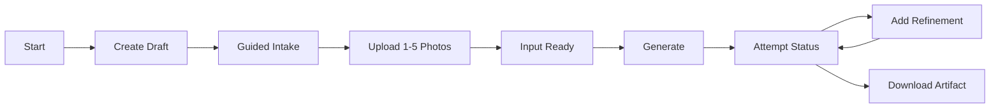

# AI Artist M1 LLD-01: Website Intake, Status, and Delivery UX

## Document Control

| Field | Value |
| --- | --- |
| LLD | LLD-01 |
| Product milestone | M1: `Memory Product Pack Agent` |
| Primary source | [M1 HLD](../hld/milestone-1-high-level-design.md) |
| Status | Implementation-ready draft |
| Scope owner | Customer website intake, upload UX, status UX, refinement UX, and artifact delivery |

## Purpose

LLD-01 defines the customer-facing website flow for creating a postcard-style artifact from 1 to 5 photos and a small set of creative inputs.

The website is not a marketplace, account portal, operator dashboard, or generic image-generation playground.

## In Scope

- Public product-start page.
- Draft task creation before upload.
- Guided intake for 1 to 5 photos.
- Upload UI using backend-issued upload slots.
- `title`, `note`, and `style` collection.
- Generate action that creates Attempt 1.
- Refinement action that accepts only `refinement_note`.
- Task input status and current attempt status.
- Attempt history view.
- Delivery of a fixed-dimension postcard PNG artifact.

## Out Of Scope

- Accounts, login, dashboards, or public galleries.
- Payment, checkout, subscriptions, or usage credits.
- Rights, copyright, or license workflows in this first version.
- Marketplace publishing, listing drafts, POD, NFT, fulfillment, or buyer messaging.
- Operator review UI.
- Exposing internal artifacts or storage references.
- Direct customer control over S3 object keys, attempt IDs, or runtime prefixes.

## Primary User Flow



## Screens

### Start

Goals:

- Show the concrete M1 output: a postcard-style PNG.
- Explain that users provide photos, title, note, and style.
- Avoid marketplace income claims and seller-pack language.

Customer-visible artifact:

- One fixed-dimension postcard PNG.

### Guided Intake

Required fields:

| Field | Purpose |
| --- | --- |
| `photos` | 1 to 5 uploaded photos. |
| `title` | Customer-provided artifact title. |
| `note` | Customer-provided creative note. |
| `style` | M1-approved visual direction. |

The first demo exposes one style ID: `warm_handmade`.

The UI saves title, note, and style through `PATCH /v1/tasks/{task_id}`. It may mirror backend constraints but must treat LLD-02 validation as authoritative. The UI uses `title` 1–120 characters, `note` 1–1000 characters, and the fixed style `warm_handmade`. Once the task is `ready`, these base inputs and the photo set are immutable.

### Upload

The browser requests upload slots from LLD-02 and uploads directly through short-lived presigned POST or equivalent URLs.

UX requirements:

- Show per-photo upload progress.
- Accept only JPEG and PNG photos, up to 20 MB per photo and 5 photos per Task.
- Request the desired total photo count in the upload-slots request.
- Do not offer a lower photo count while uploaded or pending slots already exceed it; wait for pending slots to expire.
- Expire stale upload slots gracefully.
- Let the user retry a failed upload with a fresh backend-issued slot.
- Do not expose private bucket names, object keys, signed URL query strings, or task tokens.

### Generate And Refine

The Generate screen shows:

- Photo count.
- Title, note, and style.
- Expected fixed-dimension postcard PNG output.

The first `Generate` action creates Attempt 1. A later refinement action accepts only `refinement_note` and creates a new attempt after the current attempt is `ready` or `failed`.

Only one attempt may be `queued` or `generating` for a task at a time.

### Status

The UI displays task input status separately from current attempt status.

Task status:

| Status | Customer behavior |
| --- | --- |
| `draft` | Required text fields or photos are incomplete. |
| `uploading` | Photos are being uploaded. |
| `ready` | Input is complete and can generate or refine. |

Attempt status:

| Status | Customer behavior |
| --- | --- |
| `queued` | Generation is waiting to start. |
| `generating` | Postcard artifact is being generated. |
| `ready` | Artifact is available. |
| `failed` | Generation failed; refinement or retry is available. |

The UI may display attempt history from `GET /v1/tasks/{task_id}/attempts`. The current attempt is shown by default; previous ready artifacts remain downloadable.

The UI must not expose:

- S3 keys or bucket names.
- Presigned URL internals.
- Prompt logs, provider errors, or stack traces.
- Internal generation or operational metadata.

### Delivery

The delivery screen requests a fresh download URL for a ready postcard artifact.

Rules:

- Display the artifact filename and dimensions.
- Refresh expired download links through the artifact download API.
- Do not place raw presigned URLs in copy, logs, or emails.

## Task-Link Security UX

Default delivery is task-link-only.

The task link format is:

```text
https://app.example.com/task/{task_id}#access_token={task_access_token}
```

The frontend extracts the URL fragment and sends the token only in:

```http
Authorization: Bearer <task_access_token>
```

Rules:

- Prefer in-memory token storage.
- `sessionStorage` is acceptable only to survive refresh.
- `localStorage` is prohibited.
- Do not put tokens in query strings, paths, cookies, analytics, or visible support copy.
- If the link is lost, the customer must start a new task.

## Customer-Safe Copy Rules

`failed`:

- Present the issue as a technical failure or retry path.
- Avoid stack traces and provider internals.

`ready`:

- Show artifact availability and the download action.
- Avoid public bucket language.

## Dependencies

LLD-01 depends on:

- LLD-02 for task creation, upload slots, input validation, task status, attempt creation, status metadata, token validation, attempt history, and artifact download links.
- LLD-03 for artifact generation and readiness metadata.
- LLD-05 for task-link constraints, public runtime config, no-store/cache/referrer policy requirements, and private storage.

LLD-01 provides:

- Customer-facing task and attempt status labels.
- UX constraints for upload retry and artifact download refresh.
- Refinement behavior and customer-safe failure copy.

## Acceptance Checks

- A user can create a draft, upload 1 to 5 photos, enter title/note/style, and reach task status `ready`.
- The first Generate action creates Attempt 1.
- A refinement submits only `refinement_note` and creates a later attempt only when no attempt is queued or generating.
- The UI does not expose internal artifacts or private storage details.
- Task tokens use fragment-to-Authorization-header transport.
- Status screens distinguish task status from attempt status.
- Attempt history is viewable and previous ready artifacts remain downloadable.
- Delivery uses a fresh short-lived artifact download URL.
- The UI does not introduce accounts, payment, marketplace publishing, POD, NFT, public gallery, rights workflow, or operator review.

## Open Questions

None. Public domain and route structure are deployment parameters.
