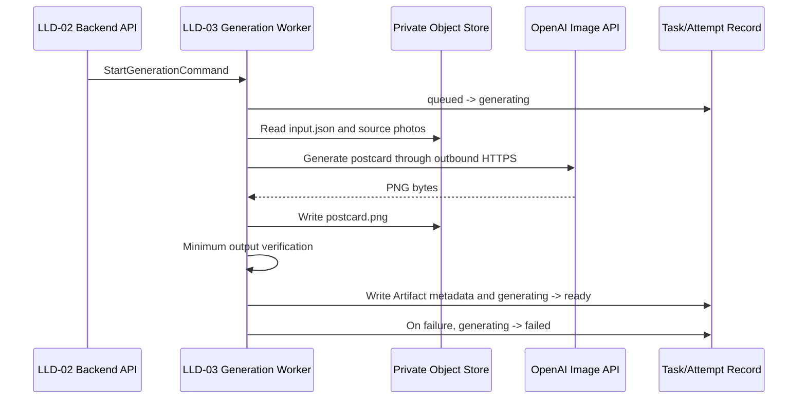

# AI Artist M1 LLD-03: Postcard Generation Worker

## Document Control

| Field | Value |
| --- | --- |
| LLD | LLD-03 |
| Product milestone | M1: `Memory Product Pack Agent` |
| Primary source | [M1 HLD](../hld/milestone-1-high-level-design.md) |
| Status | Implementation-ready draft |
| Scope owner | Postcard generation, minimum output verification, artifact metadata, and Attempt status updates |

## Purpose

LLD-03 defines the internal worker that turns one immutable Attempt snapshot and 1 to 5 source photos into one postcard PNG.

The worker is not customer-facing. It consumes an internal `StartGenerationCommand`, reads private inputs, generates one artifact, performs deterministic minimum verification, writes artifact metadata, and directly updates the Attempt status.

## In Scope

- `StartGenerationCommand` consumption.
- Attempt execution and status updates.
- Reading the Attempt `input.json` snapshot.
- Reading 1 to 5 private source photos.
- A provider boundary with one M1 production adapter: OpenAI Image API.
- Fixed `gpt-image-2-2026-04-21` model and image-edit request contract.
- Deterministic fake provider for development, tests, and smoke verification.
- Deterministic provider-output normalization to the postcard dimensions.
- Fixed `1800x1200` PNG output.
- Minimum output verification.
- Artifact metadata persistence.
- Customer-safe generation failure reason codes.

## Out Of Scope

- Website intake UX.
- Upload-slot creation.
- Task creation or Attempt creation.
- Task metadata/status API ownership.
- Rights, copyright, or license workflows in this first version.
- Automated visual quality scoring.
- Human QA.
- ZIP packaging, PDF output, or multi-artifact delivery.
- Download URL issuance.
- Marketplace publishing, POD, NFT, listing kits, or buyer messaging.

## Identity And Input Contract

`attempt_id` is the identity of one generation execution. M1 does not introduce a separate `generation_job_id`, `generation_version`, or freshness identifier.

LLD-03 consumes:

```json
{
  "command_version": "m1.start_generation.v1",
  "task_id": "task_01J...",
  "attempt_id": "att_01J...",
  "input_snapshot_ref": {
    "bucket": "private-runtime-bucket",
    "key": "tasks/task_01J.../attempts/att_01J.../input.json",
    "sha256": "..."
  },
  "source_asset_ids": [
    "asset_01J...",
    "asset_02J..."
  ],
  "output_prefix": "tasks/task_01J.../attempts/att_01J.../",
  "idempotency_key": "task_01J...:attempt_att_01J...",
  "created_at": "2026-08-24T00:00:00Z"
}
```

The input snapshot is the generation source of truth:

```json
{
  "photo_asset_ids": ["asset_01J...", "asset_02J..."],
  "title": "Spring Walk in Kyoto",
  "note": "A quiet spring afternoon",
  "style": "warm_handmade",
  "refinement_note": "Use softer colors and a larger title"
}
```

Rules:

- LLD-03 does not create `task_id` or `attempt_id`.
- LLD-03 does not modify the input snapshot.
- `source_asset_ids` must match the snapshot photo references.
- The job table prevents a duplicate command with the same `idempotency_key`; if one is observed, the worker must not make another provider call or create another artifact.
- Platform invocation IDs may be used in logs only; they are not domain fields or cross-service contract fields.
- A claimed job is single-delivery in M1. Failure or lease expiry is terminal for that Attempt and never re-enqueues the command.
- The worker makes at most one provider invocation for an Attempt.

## Worker Flow



LLD-03 directly updates the Attempt status. There is no mandatory `GenerationCompleted` or `GenerationFailed` handoff to LLD-04 in M1.

## Attempt Status Rules

LLD-02 creates the Attempt with:

```text
queued
```

LLD-03 may conditionally claim it:

```text
queued -> generating
```

Successful generation and verification:

```text
generating -> ready
```

Provider, storage, or verification failure:

```text
generating -> failed
```

LLD-03 must not claim an Attempt that is already `ready`, `failed`, or owned by another active execution.

There is no automatic generation retry. A failed Attempt remains immutable and terminal. A customer may later create a distinct Attempt with a new `attempt_id` and optional `refinement_note`; that is a new generation request, not a retry of the failed job.

## External Provider Boundary

Provider-specific calls live behind a small adapter:

```python
class GenerationProvider(Protocol):
    provider_id: str
    provider_version: str

    def generate_postcard(self, input: GeneratePostcardInput) -> GeneratedImage:
        ...
```

`GeneratePostcardInput` includes the input snapshot and 1 to 5 decoded/source asset references. `GeneratedImage` contains provider PNG bytes plus the narrow provider metadata needed for internal logs. The configured provider is `openai` for normal Phase 1 household use; `fake` is reserved for deterministic tests and smoke verification.

The worker calls OpenAI over outbound HTTPS using the official Python SDK and a Kubernetes Secret. It does not run foundation-model weights on the home server. Provider credentials, raw responses, and full prompts must not be written to artifacts or logs.

The OpenAI client must be constructed with `OpenAI(max_retries=0, timeout=480.0)`. No HTTP wrapper, sidecar, or service mesh may add provider-call retries. This overrides the Python SDK default retry behavior and makes one Worker invocation equal one outbound provider attempt.

### Fixed OpenAI Request

M1 uses the Image API edit endpoint because generation is grounded in 1 to 5 customer photos:

```text
endpoint: POST /v1/images/edits
model: gpt-image-2-2026-04-21
image: all 1 to 5 validated source photos in Task order
prompt: server-built postcard instruction from the immutable Attempt snapshot
n: 1
quality: medium
size: 1808x1200
output_format: png
```

The dated model snapshot freezes M1 behavior. Changing the model, quality, or provider output size is a design change requiring fixture and real-provider E2E revalidation; it is not an unreviewed deployment toggle.

`1800x1200` cannot be requested directly because GPT Image 2 requires each output edge to be divisible by 16. The adapter therefore requests `1808x1200`; after decoding the PNG, the worker removes exactly 4 pixels from the left edge and 4 pixels from the right edge. It does not scale, stretch, or use content-aware cropping. The normalized bytes are re-encoded as PNG and become the only candidate customer artifact.

The first real-provider readiness check must use owned or repository-approved fixture photos and prove that the configured OpenAI account can access the model. OpenAI organization verification, if required for GPT Image access, is a deployment prerequisite rather than an application fallback.

### Deterministic Fake Provider

The fake provider is a development/test implementation. Given the same snapshot and source fixture inputs, it returns the same PNG result. It does not call an external model or require an API key.

It is used for:

- Local development.
- Deterministic automated tests.
- Safe demo fixtures.
- End-to-end workflow verification without provider cost or network dependency.

The fake adapter implements the same `GenerationProvider` interface and returns a deterministic `1808x1200` PNG so tests exercise the same center-crop and verification path. Anthropic and other adapters are deferred beyond M1.

## Output Contract

LLD-03 writes exactly one customer artifact:

```text
tasks/{task_id}/attempts/{attempt_id}/postcard.png
```

Fixed output contract:

```text
format: image/png
width: 1800
height: 1200
```

The provider response is an internal intermediate. Only the normalized and verified `1800x1200` PNG is stored at the customer artifact path.

Artifact metadata:

```json
{
  "artifact_id": "artifact_01J...",
  "task_id": "task_01J...",
  "attempt_id": "att_01J...",
  "artifact_type": "postcard",
  "filename": "spring-walk-in-kyoto.png",
  "mime_type": "image/png",
  "width": 1800,
  "height": 1200,
  "size_bytes": 1248290,
  "sha256": "...",
  "storage_key": "tasks/task_01J.../attempts/att_01J.../postcard.png",
  "status": "ready"
}
```

The storage key is internal and is not returned through the customer metadata API.

## Minimum Output Verification

Before setting the Attempt to `ready`, LLD-03 must verify:

- The output object exists.
- The file can be decoded as PNG.
- MIME type is `image/png`.
- Width is exactly `1800` pixels.
- Height is exactly `1200` pixels.
- File size is within the configured limit.
- The stored checksum matches the generated bytes.
- The object is under the current Task/Attempt output prefix.

Minimum verification does not judge visual taste, text quality, composition, or commercial readiness.

Suggested internal failure codes:

```text
INPUT_SNAPSHOT_UNREADABLE
SOURCE_ASSET_UNREADABLE
PROVIDER_FAILED
OUTPUT_NOT_FOUND
OUTPUT_NOT_PNG
OUTPUT_DIMENSIONS_INVALID
OUTPUT_SIZE_INVALID
OUTPUT_CHECKSUM_MISMATCH
OUTPUT_PATH_INVALID
```

## Failure Behavior

Customer-facing Attempt failure metadata must be safe:

```json
{
  "status": "failed",
  "reason_code": "generation_failed",
  "retryable": false,
  "new_attempt_allowed": true
}
```

Internal logs may retain a narrow failure category and platform/provider correlation ID, but must not contain secrets, signed URLs, raw images, credentials, or unnecessary customer content.

Provider failure, output normalization failure, output verification failure, and job lease expiry all make the current Attempt terminal. No code path automatically calls the provider again. LLD-05 owns the conditional job finalization and expired-lease reconciliation that prevent a late Worker response from overwriting a terminal failure.

## Dependencies

LLD-03 depends on:

- LLD-02 for `StartGenerationCommand`, Task/Attempt records, immutable input snapshots, source asset metadata, and Attempt creation.
- LLD-05 for private object storage, durable jobs, runtime mode, provider secrets, retention, and observability.

LLD-03 provides:

- Postcard PNG artifact.
- Artifact metadata.
- Attempt status updates.
- Customer-safe failure reason codes.
- Provider-neutral generation boundary.

## Acceptance Checks

- LLD-03 consumes the simplified `StartGenerationCommand`.
- No separate `generation_job_id`, `generation_version`, or `latest_eligible_attempt_id` is used.
- The worker reads the immutable Attempt snapshot.
- The worker supports 1 to 5 source photos.
- The worker generates exactly one `1800x1200` postcard PNG.
- Minimum output verification runs before `Attempt.status = ready`.
- Generation or verification failures set `Attempt.status = failed`.
- The Worker makes at most one provider call for each Attempt.
- Failure and lease expiry never re-enqueue or redeliver the generation command.
- A late Worker response cannot overwrite an expired or failed job.
- The fake provider runs without external credentials.
- The OpenAI adapter uses `gpt-image-2-2026-04-21` through `/v1/images/edits`, sends all 1 to 5 photos, requests one `medium`-quality `1808x1200` PNG, and receives its API key only from a server-side Secret.
- The OpenAI SDK is configured with `max_retries=0`; no other transport layer retries the request.
- The Worker center-crops the provider output to `1800x1200` before minimum verification.
- No foundation model runs on the home server.
- No ZIP, PDF, multi-artifact, marketplace, POD, NFT, or publishing side effect is introduced.

## Provider Configuration

`AI_ARTIST_GENERATION_PROVIDER` may be `openai` or `fake`. The production model, quality, provider output size, normalized output size, and no-retry rule are fixed M1 contracts. `OPENAI_API_KEY` is the only provider credential and remains a deployment Secret.

Official references used to freeze this contract:

- [GPT Image 2 model](https://developers.openai.com/api/docs/models/gpt-image-2)
- [OpenAI image generation and edit guide](https://developers.openai.com/api/docs/guides/image-generation)
- [Official OpenAI Python SDK retry configuration](https://github.com/openai/openai-python#retries)
