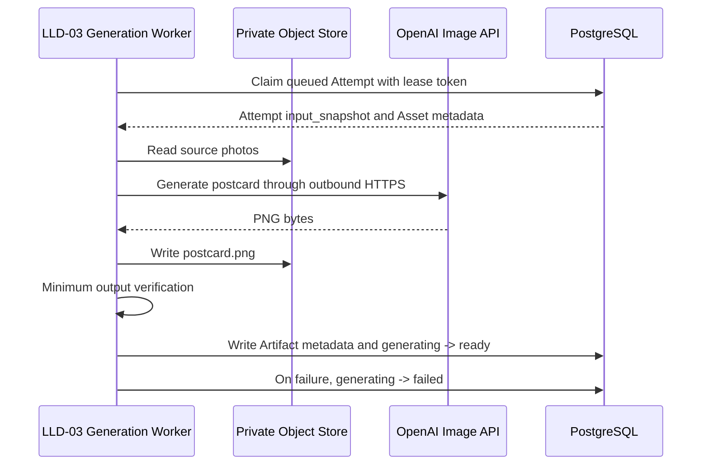

# AI Artist M1 LLD-03: Postcard Generation Worker

## Document Control

| Field | Value |
| --- | --- |
| LLD | LLD-03 |
| Product milestone | M1: `Memory Postcard Studio` |
| Primary source | [M1 HLD](../hld/milestone-1-high-level-design.md) |
| Status | Fake and OpenAI providers implemented; real-provider E2E pending |
| Scope owner | Postcard generation, minimum output verification, artifact metadata, and Attempt status updates |

## Purpose

LLD-03 defines the internal worker that turns one immutable Attempt snapshot and 1 to 5 source photos into one postcard PNG.

The worker is not customer-facing. It atomically claims a queued Attempt from PostgreSQL, reads its immutable inputs, generates one artifact, performs deterministic minimum verification, writes artifact metadata, and directly updates the Attempt status.

## Implementation Status

The current repository implements `GenerationProvider`, `FakeGenerationProvider`, `OpenAIGenerationProvider`, provider-neutral Worker execution, normalization, lease fencing, Artifact persistence, and failure handling. The default runnable setting is `AI_ARTIST_GENERATION_PROVIDER=fake`; deploy-time selection may set it to `openai` only after the Worker-only `ai-artist-openai` Secret is present.

The OpenAI request, prompt, credential, and zero-retry sections below are implemented contracts. They are covered by deterministic adapter tests; credentialed server deployment and owned-fixture E2E remain operational verification work.

## In Scope

- Durable queued-Attempt claiming with lease fencing.
- Attempt execution and status updates.
- Reading the Attempt `input_snapshot` JSONB value.
- Reading 1 to 5 private source photos.
- A provider boundary with an implemented deterministic fake adapter and a target OpenAI Image API adapter.
- Fixed `gpt-image-2-2026-04-21` model and image-edit request contract.
- Deterministic fake provider for development, tests, and smoke verification.
- Deterministic provider-output normalization to the postcard dimensions.
- Fixed `1800x1200` PNG output.
- Minimum output verification.
- Artifact metadata persistence.
- Customer-safe generation failure reason codes.

## Out Of Scope

- Website intake UX.
- Upload-slot creation.
- Task creation or Attempt creation.
- Task metadata/status API ownership.
- Rights, copyright, or license workflows in this first version.
- Automated visual quality scoring.
- Human QA.
- ZIP packaging, PDF output, or multi-artifact delivery.
- Download URL issuance.
- Marketplace publishing, POD, NFT, listing kits, or buyer messaging.

## Identity And Input Contract

`attempt_id` is the identity of one generation execution. M1 does not introduce a separate `generation_job_id`, `generation_version`, or freshness identifier.

LLD-03 claims this PostgreSQL Attempt shape:

```json
{
  "attempt_id": "att_01J...",
  "task_id": "task_01J...",
  "status": "queued",
  "input_snapshot": {},
  "provider_id": "openai",
  "provider_model": "gpt-image-2-2026-04-21",
  "lease_token": null,
  "lease_expires_at": null
}
```

The input snapshot is the generation source of truth:

```json
{
  "schema_version": "m1.attempt_input.v1",
  "task_id": "task_01J...",
  "photo_asset_ids": ["asset_01J...", "asset_02J..."],
  "title": "Spring Walk in Kyoto",
  "note": "A quiet spring afternoon",
  "style": "warm_handmade",
  "prompt_recipe_version": "m1.postcard_prompt.v1",
  "refinement_note": "Use softer colors and make the garden more prominent",
  "output": {
    "artifact_type": "postcard",
    "format": "png",
    "width": 1800,
    "height": 1200
  }
}
```

Rules:

- LLD-03 does not create `task_id` or `attempt_id`.
- LLD-03 does not modify the input snapshot.
- LLD-03 rejects an unsupported `prompt_recipe_version`; it must not silently use the latest deployed recipe.
- Source Asset rows must match the snapshot photo references and the same Task.
- The partial unique active-Attempt index and conditional claim prevent duplicate active execution for one Task.
- Platform invocation IDs may be used in logs only; they are not domain fields or cross-service contract fields.
- A claimed Attempt is single-delivery in M1. Failure or lease expiry is terminal and never returns it to `queued`.
- The worker makes at most one provider invocation for an Attempt.

## Worker Flow



LLD-03 directly updates the Attempt status. There is no mandatory `GenerationCompleted` or `GenerationFailed` handoff to LLD-04 in M1.

## Attempt Status Rules

LLD-02 creates the Attempt with:

```text
queued
```

LLD-03 may conditionally claim it:

```text
queued -> generating
```

Successful generation and verification:

```text
generating -> ready
```

Provider, storage, normalization, verification, or lease-expiry failure:

```text
generating -> failed
```

LLD-03 must not claim an Attempt that is already `ready`, `failed`, or owned by another active execution.

Every successful `queued -> generating`, `generating -> ready`, or `generating -> failed` transaction also advances the owning `tasks.updated_at`. This keeps the system Task collection ordered by current asynchronous activity without exposing provider or queue metadata.

There is no automatic generation retry. A failed Attempt remains immutable and terminal. A customer may later create a distinct Attempt with a new `attempt_id` and required `refinement_note`; that is a new generation request, not a retry of the failed Attempt.

## External Provider Boundary

Provider-specific calls live behind a small adapter:

```python
class GenerationProvider(Protocol):
    provider_id: str
    provider_model: str

    def generate_postcard(self, input: GeneratePostcardInput) -> GeneratedImage:
        ...
```

`GeneratePostcardInput` includes the input snapshot and 1 to 5 decoded/source asset references. `GeneratedImage` contains provider PNG bytes plus the narrow provider metadata needed for internal logs. The implemented provider is `fake`; `openai` becomes the normal household target only after its adapter readiness checks pass.

The target adapter calls OpenAI over outbound HTTPS using the official Python SDK and a Kubernetes Secret. It does not run foundation-model weights on the home server. Provider credentials, raw responses, and full prompts must not be written to artifacts or logs.

The OpenAI client must be constructed with `OpenAI(max_retries=0, timeout=480.0)`. No HTTP wrapper, sidecar, or service mesh may add provider-call retries. This overrides the Python SDK default retry behavior and makes one Worker invocation equal one outbound provider attempt.

### Target OpenAI Request

M1 uses the Image API edit endpoint because generation is grounded in 1 to 5 customer photos:

```text
endpoint: POST /v1/images/edits
model: gpt-image-2-2026-04-21
image: all 1 to 5 validated source photos in snapshot array order for transport only
prompt: server-built m1.postcard_prompt.v1 instruction from the immutable Attempt snapshot
n: 1
quality: medium
size: 1808x1200
output_format: png
```

The adapter sends the photos in `photo_asset_ids` array order only to make request construction deterministic. That order has no product meaning: the prompt treats the photos as an unordered reference set and does not make the first photo primary.

The dated model snapshot freezes M1 behavior. Changing the model, quality, or provider output size is a design change requiring fixture and real-provider E2E revalidation; it is not an unreviewed deployment toggle.

`1800x1200` cannot be requested directly because GPT Image 2 requires each output edge to be divisible by 16. The adapter therefore requests `1808x1200`; after decoding the PNG, the worker removes exactly 4 pixels from the left edge and 4 pixels from the right edge. It does not scale, stretch, or use content-aware cropping. The normalized bytes are re-encoded as PNG and become the only candidate customer artifact.

The first real-provider readiness check must use owned or repository-approved fixture photos and prove that the configured OpenAI account can access the model. OpenAI organization verification, if required for GPT Image access, is a deployment prerequisite rather than an application fallback.

### Prompt Recipe: `m1.postcard_prompt.v1`

The backend renders one server-owned prompt from the immutable Attempt snapshot. `title`, `note`, and `refinement_note` are delimited customer data and are interpreted only as creative guidance; they do not replace the server-owned constraints.

```text
Create one landscape travel-memory postcard artwork grounded in all supplied
reference photos.

REFERENCE SET
- Treat the supplied photos as an unordered set with no first-image priority.
- Identify the shared people, place, event, and strongest scene anchors.
- Synthesize one coherent scene rather than a default grid or literal collage.

NON-NEGOTIABLE PRESERVATION
- Keep each depicted person's recognizable identity, facial structure, and
  distinguishing features faithful to the references.
- Preserve the essential people and major scene anchors that make the memory
  recognizable.
- Do not invent a different identity or replace the memory with an unrelated
  location or event.

CREATIVE DIRECTION
- Creatively recompose the scene when it improves the memory: adjust framing,
  layout, lighting, atmosphere, palette, background simplification, and subtle
  decorative details in ways that fit the referenced scene.
- Keep the result cohesive and believable as one travel-memory artwork.

STYLE: warm_handmade
- Use a warm handmade postcard aesthetic with hand-painted character, natural
  colors, soft organic texture, gentle paper or brush detail, and an intimate,
  nostalgic mood.
- Avoid extreme cartoon distortion that damages identity or scene recognition.

CUSTOMER GUIDANCE
- Title context: <title>
- Memory guidance: <note>
- Use both as visual and thematic guidance only.
- Do not render the title, note, refinement instruction, captions, typography,
  signatures, or watermarks into the image.

ADDITIVE REFINEMENT
- Additional guidance: <refinement_note or "none">
- When present, add this guidance to the base recipe; do not replace the base
  recipe, preservation rules, style, or output rules.

OUTPUT
- Produce exactly one landscape composition for the requested PNG output.
```

The `refinement_note` is additive to the same base recipe. It may refine emphasis, composition, color, or atmosphere, but it cannot remove identity preservation, major-scene preservation, the no-visible-customer-text rule, or the fixed output contract. M1 creates each Attempt from the original source-photo set; it does not feed the previous generated postcard back to the provider.

### Deterministic Fake Provider

The fake provider is a development/test implementation. Given the same snapshot and source fixture inputs, it returns the same PNG result. It does not call an external model or require an API key.

It is used for:

- Local development.
- Deterministic automated tests.
- Safe demo fixtures.
- End-to-end workflow verification without provider cost or network dependency.

The fake adapter implements the same `GenerationProvider` interface and returns a deterministic `1808x1200` PNG so tests exercise the same center-crop and verification path. Anthropic and other adapters are deferred beyond M1.

## Output Contract

LLD-03 writes exactly one customer artifact:

```text
tasks/{task_id}/attempts/{attempt_id}/postcard.png
```

Fixed output contract:

```text
format: image/png
width: 1800
height: 1200
```

The provider response is an internal intermediate. Only the normalized and verified `1800x1200` PNG is stored at the customer artifact path.

Artifact metadata:

```json
{
  "artifact_id": "artifact_01J...",
  "task_id": "task_01J...",
  "attempt_id": "att_01J...",
  "artifact_type": "postcard",
  "filename": "spring-walk-in-kyoto.png",
  "mime_type": "image/png",
  "width": 1800,
  "height": 1200,
  "size_bytes": 1248290,
  "sha256": "...",
  "storage_key": "tasks/task_01J.../attempts/att_01J.../postcard.png"
}
```

The database stores the normative LLD-02 Artifact columns. Width and height above are derived fixed-contract metadata, not database columns. The storage key is internal and is not returned through the customer metadata API.

## Minimum Output Verification

Before setting the Attempt to `ready`, LLD-03 must verify:

- The output object exists.
- The file can be decoded as PNG.
- MIME type is `image/png`.
- Width is exactly `1800` pixels.
- Height is exactly `1200` pixels.
- File size is within the configured limit.
- The stored checksum matches the generated bytes.
- The object is under the current Task/Attempt output prefix.

Minimum verification does not judge visual taste, text quality, composition, or commercial readiness.

Suggested internal failure codes:

```text
INPUT_SNAPSHOT_UNREADABLE
SOURCE_ASSET_UNREADABLE
PROVIDER_FAILED
OUTPUT_NOT_FOUND
OUTPUT_NOT_PNG
OUTPUT_DIMENSIONS_INVALID
OUTPUT_SIZE_INVALID
OUTPUT_CHECKSUM_MISMATCH
OUTPUT_PATH_INVALID
```

## Failure Behavior

Customer-facing Attempt failure metadata must be safe:

```json
{
  "status": "failed",
  "failure_code": "generation_failed"
}
```

The customer API derives the available next action from Attempt status. A failed Attempt is terminal and is never retried; the UI may offer the existing user-initiated refinement action, which creates a distinct Attempt.

Internal logs may retain a narrow failure category and platform/provider correlation ID, but must not contain secrets, signed URLs, raw images, credentials, or unnecessary customer content.

Provider failure, output normalization failure, output verification failure, and Attempt lease expiry all make the current Attempt terminal. No code path automatically calls the provider again. LLD-05 owns conditional Attempt finalization and expired-lease reconciliation so a late Worker response cannot overwrite terminal failure.

## Dependencies

LLD-03 depends on:

- LLD-02 for the four-table schema, queued Attempt rows, immutable input snapshots, source Asset metadata, and Attempt creation.
- LLD-05 for private object storage, Attempt claiming/leases, runtime mode, provider secrets, retention, and observability.

LLD-03 provides:

- Postcard PNG artifact.
- Artifact metadata.
- Attempt status updates.
- Customer-safe failure reason codes.
- Provider-neutral generation boundary.

## Acceptance Checks

- LLD-03 atomically claims the oldest queued Attempt from PostgreSQL.
- No separate `generation_job_id`, `generation_version`, or `latest_eligible_attempt_id` is used.
- The worker reads the immutable Attempt snapshot.
- The snapshot fixes `prompt_recipe_version = m1.postcard_prompt.v1`.
- The worker supports 1 to 5 source photos.
- Source-photo order has no product semantics and does not select a primary photo.
- The prompt preserves recognizable people and major scene anchors while allowing scene-aware creative recomposition.
- `title`, `note`, and `refinement_note` guide the visual result but are not rendered as visible customer text.
- A refinement note supplements rather than replaces the base prompt recipe.
- The worker generates exactly one `1800x1200` postcard PNG.
- Minimum output verification runs before `Attempt.status = ready`.
- Generation or verification failures set `Attempt.status = failed`.
- Every Attempt lifecycle transition advances the owning `tasks.updated_at` in the same transaction.
- The Worker makes at most one provider call for each Attempt.
- Failure and lease expiry never return an Attempt to `queued`.
- A late Worker response cannot overwrite an expired or failed Attempt.
- The fake provider runs without external credentials.
- Before the target adapter is declared complete, it uses `gpt-image-2-2026-04-21` through `/v1/images/edits`, sends all 1 to 5 photos, requests one `medium`-quality `1808x1200` PNG, and receives its API key only from a server-side Secret.
- Before the target adapter is declared complete, the OpenAI SDK is configured with `max_retries=0`; no other transport layer retries the request.
- The Worker center-crops the provider output to `1800x1200` before minimum verification.
- No foundation model runs on the home server.
- No ZIP, PDF, multi-artifact, marketplace, POD, NFT, or publishing side effect is introduced.

## Provider Configuration

The repository accepts `AI_ARTIST_GENERATION_PROVIDER=fake|openai` at deployment time, defaulting to `fake`. `openai` requires the `ai-artist-openai` Kubernetes Secret with `OPENAI_API_KEY`, mounted only into the Generation Worker. The model, quality, provider output size, normalized output size, and no-retry rule remain fixed M1 design contracts rather than deployment toggles.

Official references used to freeze this contract:

- [GPT Image 2 model](https://developers.openai.com/api/docs/models/gpt-image-2)
- [OpenAI image generation and edit guide](https://developers.openai.com/api/docs/guides/image-generation)
- [GPT Image generation models prompting guide](https://developers.openai.com/cookbook/examples/multimodal/image-gen-models-prompting-guide)
- [Official OpenAI Python SDK retry configuration](https://github.com/openai/openai-python#retries)
