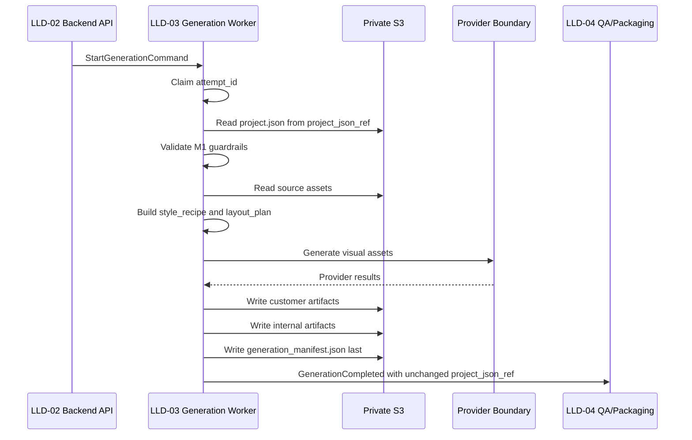

# AI Artist M1 LLD-03: Internal Generation API and Async Generation Worker

## Document Control

| Field | Value |
| --- | --- |
| LLD | LLD-03 |
| Product milestone | M1: `Memory Product Pack Agent` |
| Primary source | [M1 HLD](../hld/milestone-1-high-level-design.md) |
| Status | Reviewer reconfirmed signoff |
| Scope owner | Internal generation command consumption, async generation worker, generated artifacts, `generation_manifest.json`, and QA handoff |

## Purpose

LLD-03 defines the internal generation worker that turns validated M1 input into generated customer artifacts and generation-stage internal artifacts.

The worker is not customer-facing. It consumes LLD-02 `StartGenerationCommand`, reads `project.json` and source assets from private storage, writes attempt-scoped outputs, and emits a QA handoff event.

## In Scope

- Internal generation trigger contract consumption.
- Attempt-scoped worker execution.
- Provider-neutral generation boundary.
- Style recipe and layout plan creation.
- Customer artifact generation:
  - `sticker_sheet.png`
  - `sticker_sheet.pdf`
  - `postcard.png`
  - `postcard.pdf`
  - `poster.png`
  - `poster.pdf`
  - `social_preview.png`
- Internal generation artifacts:
  - `generation_manifest.json`
  - `prompt_log.json`
  - `generation_notes.md`
  - `style_recipe.json`
  - `layout_plan.json`
- `GenerationCompleted` and `GenerationFailed` events.
- Fake-provider path for deterministic demo verification.

## Out Of Scope

- Website intake UX.
- Upload URL creation.
- Full `project.json` schema ownership.
- Automated QA implementation.
- Canonical package `manifest.json`.
- `quality_report.json`.
- `final_download_pack.zip`.
- Download links and notifications.
- Customer accounts, payment, marketplace publishing, POD, NFT, listing kit, buyer notes, or public gallery.

## Identity Model

| Identifier | Owner | Meaning |
| --- | --- | --- |
| `generation_version` | LLD-02 | Customer-visible generation version and runtime path component. |
| `attempt_id` | LLD-02 | Immutable generation attempt ID. LLD-03 consumes it. |
| `generation_job_id` | LLD-03 | Runtime execution ID for logs/workflow only. |

LLD-03 must not create `attempt_id`. It must not embed `attempt_id` in `project.json` as source truth.

## `StartGenerationCommand`

LLD-03 consumes the command emitted by LLD-02.

```json
{
  "command_version": "m1.start_generation.v1",
  "request_id": "req_01J...",
  "project_id": "proj_01J...",
  "generation_version": 1,
  "attempt_id": "att_01J...",
  "project_json_ref": {
    "bucket": "private-runtime-bucket",
    "key": "requests/req_01J/project/project_v1.json",
    "etag": "\"abc123\"",
    "sha256": "..."
  },
  "attempt_output_prefix": "requests/req_01J/generations/v1/attempts/att_01J/",
  "idempotency_key": "req_01J:generation_v1:attempt_att_01J:project_sha256_abcd",
  "requested_by": "backend_api",
  "created_at": "2026-08-22T00:00:00Z"
}
```

Rules:

- `project_json_ref` is LLD-02-owned immutable request metadata.
- LLD-03 may verify it.
- LLD-03 must carry it unchanged into `GenerationCompleted`.
- LLD-03 must not normalize, recompute, rename, omit, or replace `project_json_ref`.

## Worker Flow



## Preconditions

The worker must not call the provider unless:

- `command_version` is supported.
- `request_id`, `project_id`, `generation_version`, and `attempt_id` are present.
- `project_json_ref.bucket`, `project_json_ref.key`, `project_json_ref.etag`, and `project_json_ref.sha256` are present.
- Loaded `project.json` checksum matches `project_json_ref.sha256`.
- Product niche is `travel_memory_cards`.
- Rights status is `ready`.
- Source asset count is 1 to 5.
- Source asset refs are private.
- Required output targets are present through LLD-02 target metadata.
- `attempt_output_prefix` is request-, generation-version-, and attempt-scoped.

## Output Storage

All generated refs must use the LLD-05 canonical prefix:

```text
requests/{request_id}/generations/v{generation_version}/attempts/{attempt_id}/
```

Customer outputs:

```text
customer/sticker_sheet.png
customer/sticker_sheet.pdf
customer/postcard.png
customer/postcard.pdf
customer/poster.png
customer/poster.pdf
customer/social_preview.png
```

Internal outputs:

```text
internal/generation_manifest.json
internal/prompt_log.json
internal/generation_notes.md
internal/style_recipe.json
internal/layout_plan.json
```

LLD-03 must not write:

```text
package/manifest.json
qa/quality_report.json
package/final_download_pack.zip
```

## Manifest Authority

LLD-03 owns only `generation_manifest.json`.

```json
{
  "manifest_version": "m1.generation_manifest.v1",
  "request_id": "req_01J...",
  "project_id": "proj_01J...",
  "generation_version": 1,
  "attempt_id": "att_01J...",
  "generation_job_id": "genjob_01J...",
  "idempotency_key": "req_01J:generation_v1:attempt_att_01J:project_sha256_abcd",
  "project_json_ref": {
    "bucket": "private-runtime-bucket",
    "key": "requests/req_01J/project/project_v1.json",
    "etag": "\"abc123\"",
    "sha256": "..."
  },
  "status": "generated",
  "customer_artifacts": [
    {
      "artifact_type": "poster",
      "file_role": "customer",
      "format": "png",
      "bucket": "private-runtime-bucket",
      "key": "requests/req_01J/generations/v1/attempts/att_01J/customer/poster.png",
      "width": 2400,
      "height": 3000,
      "file_size_bytes": 3456789,
      "sha256": "..."
    }
  ],
  "internal_artifacts": [
    {
      "artifact_type": "style_recipe",
      "file_role": "internal",
      "format": "json",
      "bucket": "private-runtime-bucket",
      "key": "requests/req_01J/generations/v1/attempts/att_01J/internal/style_recipe.json",
      "sha256": "..."
    }
  ],
  "provider": {
    "provider_id": "fake-provider-or-real-provider",
    "provider_version": "..."
  },
  "generated_at": "2026-08-22T00:00:00Z"
}
```

`generation_manifest.json.project_json_ref` should match the unchanged `StartGenerationCommand.project_json_ref`.

## Normative `GenerationCompleted`

LLD-03 must emit `GenerationCompleted` with unchanged `project_json_ref`.

```json
{
  "event_type": "GenerationCompleted",
  "request_id": "req_...",
  "project_id": "proj_...",
  "generation_version": 1,
  "attempt_id": "att_...",
  "project_json_ref": {
    "bucket": "private-runtime-bucket",
    "key": "<LLD-02-owned project json key>",
    "etag": "...",
    "sha256": "..."
  },
  "generation_manifest_ref": {
    "bucket": "private-runtime-bucket",
    "key": "requests/{request_id}/generations/v{generation_version}/attempts/{attempt_id}/internal/generation_manifest.json",
    "etag": "...",
    "sha256": "..."
  },
  "generated_at": "2026-08-22T00:00:00Z"
}
```

LLD-04 uses `GenerationCompleted.project_json_ref` to compare against active LLD-02 request metadata before QA and packaging.

## `GenerationFailed`

LLD-03 emits structured failures when generation cannot complete.

```json
{
  "event_type": "GenerationFailed",
  "request_id": "req_01J...",
  "project_id": "proj_01J...",
  "generation_version": 1,
  "attempt_id": "att_01J...",
  "failure": {
    "category": "PROVIDER_TRANSIENT",
    "failure_stage": "provider_generation",
    "customer_state_decision": "generating",
    "customer_safe_reason_code": "GENERATION_RETRYING",
    "retryable": true,
    "retry_after_seconds": 120,
    "internal_reason": "Provider returned retryable rate-limit response while generating artifact_type=poster.",
    "provider_request_id": "provider_req_123",
    "redaction_applied": true
  },
  "failed_at": "2026-08-22T00:00:00Z"
}
```

Failure payloads must not include secrets, signed URLs, raw prompts with sensitive notes, raw images, customer email, or provider credentials.

## Provider Boundary

Provider-specific calls must live behind a small adapter:

```ts
interface GenerationProvider {
  readonly providerId: string;
  readonly providerVersion: string;
  generateVisualAsset(input: GenerateVisualAssetInput): Promise<GenerateVisualAssetResult>;
}
```

M1 should include a deterministic fake provider for smoke tests and demo fixtures.

## Rights And Scope Guardrails

The worker must not generate if:

- Rights status is not `ready`.
- Product niche is not `travel_memory_cards`.
- The project asks for celebrity, fan art, fictional character, trademark/logo-heavy, or unclear-rights workflows.
- The project asks for marketplace publishing, listing copy, POD product creation, or NFT minting.

Rights/scope outcomes map to `needs_customer_input` or `blocked` where appropriate, not generic technical failures.

## Dependencies

LLD-03 depends on:

- LLD-02 for `StartGenerationCommand`, `project.json`, `attempt_id`, `generation_version`, `project_json_ref`, and latest eligible attempt tracking.
- LLD-04 for QA thresholds, package manifest, quality report, package structure, and delivery transition.
- LLD-05 for canonical prefix, private storage, runtime mode, secrets handling, retention, and observability.

LLD-03 provides:

- Generated customer artifacts.
- `generation_manifest.json`.
- Unchanged `project_json_ref` in `GenerationCompleted`.
- `generation_manifest_ref`.
- Structured generation failures.
- Provider-neutral metrics and internal artifacts.

## Acceptance Checks

- LLD-03 consumes LLD-02 `StartGenerationCommand`.
- LLD-03 does not create `attempt_id`.
- LLD-03 reads `project.json` from `project_json_ref` and verifies checksum.
- `GenerationCompleted` includes unchanged `project_json_ref`.
- LLD-04 can compare `GenerationCompleted.project_json_ref` to active request metadata.
- LLD-03 writes `internal/generation_manifest.json`, not package `manifest.json`.
- Customer/internal artifact refs use the LLD-05 canonical prefix.
- The worker generates exactly the seven M1 core customer files.
- The worker does not generate listing kit, marketplace drafts, POD, NFT, or publishing side effects.
- A stale completed attempt is marked superseded and not handed to QA.
- Logs and artifacts do not expose secrets, signed URLs, raw images, or customer contact details.
- A fake provider can run end-to-end demo generation.

## Open Questions

- Whether first implementation should use Lambda async, SQS, or Step Functions.
- Final approved style IDs.
- Whether poster supports only `8x10` or multiple profiles.
- Prompt log storage policy: sanitized rendered prompts or template IDs plus hashes.
- PDF rendering library/runtime.
- External provider consent language for real testers.
