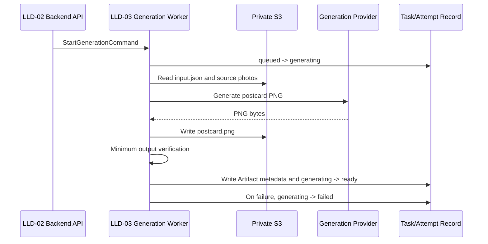

# AI Artist M1 LLD-03: Postcard Generation Worker

## Document Control

| Field | Value |
| --- | --- |
| LLD | LLD-03 |
| Product milestone | M1: `Memory Product Pack Agent` |
| Primary source | [M1 HLD](../hld/milestone-1-high-level-design.md) |
| Status | Implementation-ready draft |
| Scope owner | Postcard generation, minimum output verification, artifact metadata, and Attempt status updates |

## Purpose

LLD-03 defines the internal worker that turns one immutable Attempt snapshot and 1 to 5 source photos into one postcard PNG.

The worker is not customer-facing. It consumes an internal `StartGenerationCommand`, reads private inputs, generates one artifact, performs deterministic minimum verification, writes artifact metadata, and directly updates the Attempt status.

## In Scope

- `StartGenerationCommand` consumption.
- Attempt execution and status updates.
- Reading the Attempt `input.json` snapshot.
- Reading 1 to 5 private source photos.
- Provider-neutral postcard generation.
- Deterministic fake provider for development and demo.
- Real provider adapter boundary for later or approved runtime use.
- Fixed `1800x1200` PNG output.
- Minimum output verification.
- Artifact metadata persistence.
- Customer-safe generation failure reason codes.

## Out Of Scope

- Website intake UX.
- Upload-slot creation.
- Task creation or Attempt creation.
- Task metadata/status API ownership.
- Rights, copyright, or license workflows in this first version.
- Automated visual quality scoring.
- Human QA.
- ZIP packaging, PDF output, or multi-artifact delivery.
- Download URL issuance.
- Marketplace publishing, POD, NFT, listing kits, or buyer messaging.

## Identity And Input Contract

`attempt_id` is the identity of one generation execution. M1 does not introduce a separate `generation_job_id`, `generation_version`, or freshness identifier.

LLD-03 consumes:

```json
{
  "command_version": "m1.start_generation.v1",
  "task_id": "task_01J...",
  "attempt_id": "att_01J...",
  "input_snapshot_ref": {
    "bucket": "private-runtime-bucket",
    "key": "tasks/task_01J.../attempts/att_01J.../input.json",
    "sha256": "..."
  },
  "source_asset_ids": [
    "asset_01J...",
    "asset_02J..."
  ],
  "output_prefix": "tasks/task_01J.../attempts/att_01J.../",
  "idempotency_key": "task_01J...:attempt_att_01J...",
  "created_at": "2026-08-24T00:00:00Z"
}
```

The input snapshot is the generation source of truth:

```json
{
  "photo_asset_ids": ["asset_01J...", "asset_02J..."],
  "title": "Spring Walk in Kyoto",
  "note": "A quiet spring afternoon",
  "style": "warm_handmade",
  "refinement_note": "Use softer colors and a larger title"
}
```

Rules:

- LLD-03 does not create `task_id` or `attempt_id`.
- LLD-03 does not modify the input snapshot.
- `source_asset_ids` must match the snapshot photo references.
- A duplicate command with the same `idempotency_key` must not create a second artifact.
- Platform invocation IDs may be used in logs only; they are not domain fields or cross-service contract fields.
- On redelivery, the worker first checks the Attempt and expected output prefix; an existing valid artifact is reused and the Attempt is finalized without generating a second artifact.

## Worker Flow



LLD-03 directly updates the Attempt status. There is no mandatory `GenerationCompleted` or `GenerationFailed` handoff to LLD-04 in M1.

## Attempt Status Rules

LLD-02 creates the Attempt with:

```text
queued
```

LLD-03 may conditionally claim it:

```text
queued -> generating
```

Successful generation and verification:

```text
generating -> ready
```

Provider, storage, or verification failure:

```text
generating -> failed
```

LLD-03 must not claim an Attempt that is already `ready`, `failed`, or owned by another active execution.

## Provider Boundary

Provider-specific calls live behind a small adapter:

```ts
interface GenerationProvider {
  readonly providerId: string;
  readonly providerVersion: string;
  generatePostcard(input: GeneratePostcardInput): Promise<GeneratedPng>;
}
```

`GeneratePostcardInput` includes the input snapshot and decoded/source asset references. The provider returns PNG bytes and provider metadata needed for internal logs.

### Deterministic Fake Provider

The fake provider is a development/test implementation. Given the same snapshot and source fixture inputs, it returns the same PNG result. It does not call an external model or require an API key.

It is used for:

- Local development.
- Deterministic automated tests.
- Safe demo fixtures.
- End-to-end workflow verification without provider cost or network dependency.

The real provider, when enabled, uses the same `GenerationProvider` interface.

## Output Contract

LLD-03 writes exactly one customer artifact:

```text
tasks/{task_id}/attempts/{attempt_id}/postcard.png
```

Fixed output contract:

```text
format: image/png
width: 1800
height: 1200
```

Artifact metadata:

```json
{
  "artifact_id": "artifact_01J...",
  "task_id": "task_01J...",
  "attempt_id": "att_01J...",
  "artifact_type": "postcard",
  "filename": "spring-walk-in-kyoto.png",
  "mime_type": "image/png",
  "width": 1800,
  "height": 1200,
  "size_bytes": 1248290,
  "sha256": "...",
  "storage_key": "tasks/task_01J.../attempts/att_01J.../postcard.png",
  "status": "ready"
}
```

The storage key is internal and is not returned through the customer metadata API.

## Minimum Output Verification

Before setting the Attempt to `ready`, LLD-03 must verify:

- The output object exists.
- The file can be decoded as PNG.
- MIME type is `image/png`.
- Width is exactly `1800` pixels.
- Height is exactly `1200` pixels.
- File size is within the configured limit.
- The stored checksum matches the generated bytes.
- The object is under the current Task/Attempt output prefix.

Minimum verification does not judge visual taste, text quality, composition, or commercial readiness.

Suggested internal failure codes:

```text
INPUT_SNAPSHOT_UNREADABLE
SOURCE_ASSET_UNREADABLE
PROVIDER_FAILED
OUTPUT_NOT_FOUND
OUTPUT_NOT_PNG
OUTPUT_DIMENSIONS_INVALID
OUTPUT_SIZE_INVALID
OUTPUT_CHECKSUM_MISMATCH
OUTPUT_PATH_INVALID
```

## Failure Behavior

Customer-facing Attempt failure metadata must be safe:

```json
{
  "status": "failed",
  "reason_code": "generation_failed",
  "retryable": true
}
```

Internal logs may retain a narrow failure category and platform/provider correlation ID, but must not contain secrets, signed URLs, raw images, credentials, or unnecessary customer content.

## Dependencies

LLD-03 depends on:

- LLD-02 for `StartGenerationCommand`, Task/Attempt records, immutable input snapshots, source asset metadata, and Attempt creation.
- LLD-05 for private storage, runtime mode, secrets handling, retention, and observability.

LLD-03 provides:

- Postcard PNG artifact.
- Artifact metadata.
- Attempt status updates.
- Customer-safe failure reason codes.
- Provider-neutral generation boundary.

## Acceptance Checks

- LLD-03 consumes the simplified `StartGenerationCommand`.
- No separate `generation_job_id`, `generation_version`, or `latest_eligible_attempt_id` is used.
- The worker reads the immutable Attempt snapshot.
- The worker supports 1 to 5 source photos.
- The worker generates exactly one `1800x1200` postcard PNG.
- Minimum output verification runs before `Attempt.status = ready`.
- Generation or verification failures set `Attempt.status = failed`.
- Duplicate commands do not create duplicate artifacts.
- The fake provider runs without external credentials.
- No ZIP, PDF, multi-artifact, marketplace, POD, NFT, or publishing side effect is introduced.

## Deferred Provider Note

None for the M1 fake-provider path. A real provider remains a later adapter/configuration decision.
