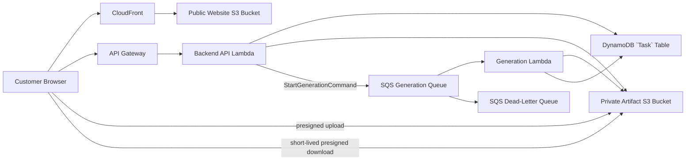

# AI Artist M1 LLD-05: AWS Runtime, Storage, Security, and Retention

## Document Control

| Field | Value |
| --- | --- |
| LLD | LLD-05 |
| Product milestone | M1: Memory Product Pack Agent |
| Primary source | [M1 HLD](../hld/milestone-1-high-level-design.md) |
| Status | Tech Lead agreed draft; cross-LLD reconfirmation pending |
| Scope owner | AWS runtime, private storage, `Task`-link security, SQS generation delivery, and retention |

## Purpose

LLD-05 defines the minimum AWS runtime and security posture for the M1 `Task` -> `Attempt` -> postcard artifact workflow.

## In Scope

- CloudFront and S3 website hosting.
- API Gateway and Lambda customer APIs.
- DynamoDB `Task` and `Attempt` metadata.
- Private S3 artifact storage.
- SQS generation queue and dead-letter queue.
- Presigned upload/download constraints.
- IAM boundaries.
- Basic CloudWatch logging.
- Simple retention and cleanup.

## Out Of Scope

- SES, WAF, Cognito, accounts, and Step Functions.
- ZIP packaging, PDF output, multi-artifact delivery, and automated visual QA.
- Marketplace, payment, POD, NFT, rights, and operator workflows.
- Complex dashboards, tracing, or alarm taxonomy.

## Runtime Topology



M1 services are CloudFront/S3, API Gateway/Lambda, DynamoDB, private S3, SQS, Generation Lambda, SQS DLQ, and basic CloudWatch logs.

## Storage Layout

LLD-05 owns:

```text
tasks/{task_id}/
  uploads/
    {asset_id}.{normalized_ext}
  attempts/
    {attempt_id}/
      input.json
      postcard.png
```

Rules:

- `input.json` is the immutable `Attempt` input snapshot.
- `postcard.png` is the only M1 customer artifact.
- The browser never chooses object keys.
- No generation_version path component is used.
- No customer/, internal/, qa/, or package/ directories are required.
- No ZIP, manifest, quality report, PDF, or prompt log is required.

Use separate logical buckets:

| Bucket | Exposure | Contents |
| --- | --- | --- |
| Website bucket | CloudFront read only | Frontend bundle and approved public demo/style assets |
| Private artifact bucket | No public access | Source uploads, input snapshots, and postcard artifacts |

## SQS Generation Delivery

1. LLD-02 writes the `Attempt` with status queued.
2. LLD-02 sends one StartGenerationCommand to SQS.
3. Generation Lambda receives the message.
4. LLD-03 conditionally updates queued -> generating.
5. LLD-03 generates, verifies, writes the artifact, and updates the `Attempt` to ready or failed.

SQS rules:

- Messages include task_id, attempt_id, input_snapshot_ref, source_asset_ids, output_prefix, and idempotency_key.
- Visibility timeout exceeds the expected maximum generation duration.
- Redelivery is safe and must not create duplicate artifacts.
- Failed messages go to the DLQ after the configured receive limit.
- M1 does not use a second QA/package queue.

## Storage Privacy And Encryption

Both buckets require:

- S3 Block Public Access.
- ACLs disabled.
- TLS-only bucket policy.
- Default server-side encryption.
- No public object ACLs.
- No public website hosting for private artifacts.

M1 may use SSE-S3 by default. SSE-KMS is deferred.

## `Task`-Link Security

`Task` link:

```text
https://app.example.com/task/{task_id}#access_token={task_access_token}
```

API transport:

```text
Authorization: Bearer <task_access_token>
```

Rules:

- Store only a `Task` token hash or HMAC.
- Never accept tokens in query strings, URL paths, cookies, or request bodies.
- Never put tokens in logs, analytics, or localStorage.
- Prefer memory; sessionStorage is allowed only for page refresh.
- task_id alone grants no access.
- The token authorizes only the associated `Task`.
- Lost links require a new `Task` in M1.
- `Task`/status/download responses use Cache-Control: no-store and Referrer-Policy: no-referrer.
- M1 task routes load no analytics pixels, tag managers, chat widgets, external fonts, or third-party scripts.

## Presigned Uploads

1. Browser authenticates with the `Task` token.
2. Backend creates a server-owned key under tasks/{task_id}/uploads/.
3. Backend returns a short-lived presigned POST.
4. Browser uploads to the private artifact bucket.
5. Browser calls the asset-complete API.
6. Backend verifies the object with S3 metadata before marking the Asset uploaded.

Rules:

- Presigned POST preferred.
- Default TTL: 15 minutes.
- Content type and maximum bytes are constrained by policy.
- CORS allows only approved website origins.
- Upload metadata contains no unnecessary PII or raw notes.

## Presigned Downloads

1. Browser calls the artifact download API with the `Task` token.
2. Backend verifies `Task` and Artifact ownership.
3. Backend verifies `Attempt` status is ready.
4. Backend returns a short-lived presigned GET URL for `postcard.png`.

Rules:

- Default TTL: 15 minutes.
- Never issue URLs for source photos or `input.json`.
- Never return S3 keys through customer APIs.
- Download URLs are not stored in DynamoDB.

## IAM Boundaries

| Principal | Allowed access |
| --- | --- |
| CloudFront OAC | Read website bucket only |
| Backend API Lambda | `Task` metadata, upload/download URL creation, and SQS send |
| Generation Lambda | Read `Task` inputs/source uploads, write current `Attempt` output, update current `Attempt` |
| SQS | Deliver generation commands |
| Cleanup process | Delete expired `Task` objects and metadata |

Generation Lambda must not issue customer download URLs or modify unrelated `Task`s.

## Configuration

Frontend-safe: AI_ARTIST_STAGE, AI_ARTIST_API_BASE_URL, AI_ARTIST_MAX_PHOTOS, AI_ARTIST_PUBLIC_ASSET_BASE_URL.

Backend:

| Config | Purpose |
| --- | --- |
| AI_ARTIST_PRIVATE_BUCKET | Private artifact bucket |
| AI_ARTIST_TASK_TABLE | DynamoDB `Task` table |
| AI_ARTIST_GENERATION_QUEUE_URL | SQS generation queue |
| AI_ARTIST_GENERATION_DLQ_URL | SQS dead-letter queue |
| AI_ARTIST_UPLOAD_URL_TTL_SECONDS | Upload URL TTL |
| AI_ARTIST_DOWNLOAD_URL_TTL_SECONDS | Download URL TTL |
| AI_ARTIST_GENERATION_MODE | fake or provider |
| AI_ARTIST_RETENTION_DAYS | Active-data retention |
| LOG_LEVEL | Basic log verbosity |

Secrets live in environment variables or AWS Secrets Manager.

## Minimum Observability

Keep only:

- CloudWatch Lambda logs.
- API Gateway 5xx logs.
- Lambda error/throttle logs.
- SQS receive count and DLQ messages.
- Generation and cleanup failure logs with task_id and attempt_id.

Logs must not include tokens, signed URLs, secrets, raw photos, or unnecessary private notes. No dashboards or complex metrics taxonomy are required.

## Retention

Retention is based on last `Task` activity:

| Data | Retention |
| --- | --- |
| Unfinished draft uploads | 24 hours |
| Source photos | 30 days |
| `Attempt` `input.json` | 30 days |
| All postcard artifacts | 30 days |
| `Task` metadata | 30 days |
| CloudWatch logs | 30 days |
| SQS DLQ messages | 14 days |

All `Attempt`s remain downloadable during the 30-day window. M1 may use S3 lifecycle rules plus a simple scheduled cleanup process. No archive tier is required.

## Acceptance Checks

- Runtime uses CloudFront/S3, API Gateway/Lambda, DynamoDB, private S3, SQS, Generation Lambda, and an SQS DLQ.
- Storage uses tasks/{task_id}/uploads/ and tasks/{task_id}/attempts/{attempt_id}/.
- `Attempt` storage contains `input.json` and `postcard.png` only.
- Upload/download URLs are short-lived.
- Private S3 has Block Public Access and default encryption.
- `Task` tokens use URL fragment plus Authorization: Bearer.
- Redelivered SQS messages do not create duplicate artifacts.
- Logs do not expose secrets or private customer content.
- SES, WAF, Step Functions, rights workflows, ZIP packaging, and complex observability are not required.

## Open Questions

- AWS region and demo domain.
- Final upload MIME types and byte limits.
- Whether the deployed demo uses fake or real provider.
- Exact SQS visibility timeout and max receive count.
