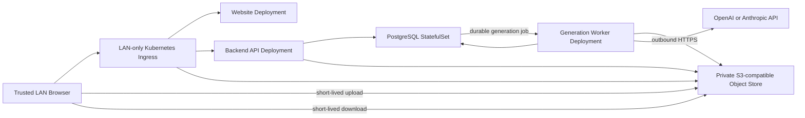

# AI Artist M1 LLD-05: Home Kubernetes Runtime, Storage, Security, and Retention

## Document Control

| Field | Value |
| --- | --- |
| LLD | LLD-05 |
| Product milestone | M1: Memory Product Pack Agent |
| Primary source | [M1 HLD](../hld/milestone-1-high-level-design.md) |
| Status | Implementation-ready draft |
| Scope owner | Home Kubernetes runtime, private storage, `Task`-link security, durable generation jobs, external AI-provider access, and retention |

## Purpose

LLD-05 defines the minimum Phase 1 runtime and security posture for the M1 `Task` -> `Attempt` -> postcard artifact workflow.

Phase 1 runs on a home Linux server with a single-node Kubernetes cluster. The website and APIs are available only to trusted devices on the home LAN. The Generation Worker calls OpenAI and/or Anthropic over outbound HTTPS using server-side API keys; the home server does not run an AI model.

AWS remains a possible later deployment target. M1 domain contracts must therefore stay independent of Kubernetes, PostgreSQL, MinIO, and AWS-specific SDK types.

## In Scope

- Single-node Kubernetes runtime on a home Linux server.
- LAN-only website, API, and object upload/download access.
- Website, Backend API, and Generation Worker Deployments.
- PostgreSQL Task/Attempt metadata and durable generation jobs.
- Private S3-compatible object storage, with MinIO as the default Phase 1 implementation.
- Short-lived upload/download constraints.
- Kubernetes Secret handling for OpenAI and Anthropic API keys.
- Basic container logging and failed-job visibility.
- Failed-job retention.
- Minimum persistence and backup posture for private photos and generated artifacts.

## Out Of Scope

- Public Internet ingress, public DNS, router port forwarding, UPnP exposure, or public tunnels.
- Multi-node Kubernetes, high availability, zero-downtime maintenance, or automatic failover.
- Local OpenAI, Claude, or other foundation-model inference.
- AWS runtime resources or AWS data migration.
- Accounts, payments, marketplace, POD, NFT, rights, or operator workflows.
- ZIP packaging, PDF output, multi-artifact delivery, and automated visual QA.
- Complex dashboards, distributed tracing, or an alert taxonomy.

## Runtime Topology



Phase 1 components are:

| Component | Kubernetes shape | Responsibility |
| --- | --- | --- |
| LAN Ingress | Existing Ingress controller | Route the private LAN hostname to the website, API, and object-store data endpoint. |
| Website | `Deployment` + `Service`, one replica | Serve the static frontend and browser-safe runtime configuration. |
| Backend API | `Deployment` + `Service`, one replica | Own customer APIs, Task tokens, metadata validation, object links, Attempt creation, and job enqueueing. |
| PostgreSQL | `StatefulSet` + `PersistentVolumeClaim`, one replica | Store Task, Asset, Attempt, Artifact, and durable job records. |
| Object store | MinIO or compatible `StatefulSet` + `PersistentVolumeClaim`, one replica | Store source uploads, immutable input snapshots, and postcard artifacts. |
| Generation Worker | `Deployment`, one replica | Claim generation jobs, call the configured external provider, verify output, and finalize Attempt state. |

All workloads run in one `ai-artist` namespace. Phase 1 assumes planned downtime during node, cluster, database, object-store, or application maintenance.

## LAN Access Boundary

The default Task link is:

```text
https://ai-artist.home.arpa/task/{task_id}#access_token={task_access_token}
```

Deployment rules:

- The Ingress address is reachable only from the trusted home subnet.
- The host firewall allows application ingress only from the configured LAN CIDR.
- The home router must not forward application ports from the Internet.
- UPnP exposure, a public tunnel, and a public `LoadBalancer` address are prohibited in Phase 1.
- Use a private LAN hostname. `ai-artist.home.arpa` is the documentation default; the actual hostname is a deployment parameter.
- Task tokens and private photos require HTTPS. A private CA or locally trusted certificate may be used; public certificate automation is not required.
- The object-store data endpoint used by presigned URLs must be reachable from LAN clients through the same private access boundary.
- The object-store administration console remains cluster-internal and is not exposed through Ingress.

## Metadata And Durable Job Storage

PostgreSQL stores Task, Asset, Attempt, Artifact, and generation-job records. Domain repositories hide SQL details from LLD-01, LLD-02, and LLD-03.

Attempt creation and job enqueueing occur in one database transaction:

1. LLD-02 validates that no Attempt is `queued` or `generating` for the Task.
2. LLD-02 writes the immutable Attempt and sets its status to `queued`.
3. LLD-02 writes one durable `StartGenerationCommand` job with the same `attempt_id` and idempotency key.
4. The transaction commits both records or neither record.

The internal job record supports:

```text
available
leased
completed
dead
```

Job delivery rules:

- The worker claims one available job atomically and records a lease expiry.
- The M1 lease is 10 minutes and the provider call timeout is 8 minutes.
- A worker restart after lease expiry makes unfinished work eligible for redelivery.
- Redelivery is safe and must not create duplicate artifacts.
- A job becomes `dead` after 3 failed deliveries.
- Dead jobs are retained for 14 days and the associated Attempt is set to `failed` with a customer-safe reason.
- Job IDs and SQL row IDs are runtime details, not customer or cross-LLD domain identities.

## Private Object Storage

LLD-05 owns this logical layout:

```text
tasks/{task_id}/
  uploads/
    {asset_id}.{normalized_ext}
  attempts/
    {attempt_id}/
      input.json
      postcard.png
```

Rules:

- `input.json` is the immutable Attempt input snapshot.
- `postcard.png` is the only M1 customer artifact.
- The browser never chooses object keys.
- The object store is not anonymously readable or listable.
- Source uploads, snapshots, and artifacts live on a persistent volume outside container filesystems.
- Presigned upload and download URLs default to a 15-minute TTL.
- Presigned URLs use a LAN-reachable object-store endpoint and are never stored in PostgreSQL.
- The Backend API verifies stored media type and size before marking an Asset `uploaded`.
- Never issue customer URLs for source photos or `input.json`.
- Never return internal object keys through customer APIs.

MinIO is the default Phase 1 implementation because it provides the required S3-compatible object API. Application code depends on an `ObjectStore` boundary rather than MinIO-specific admin APIs so the storage implementation can change later.

## External AI Provider Boundary

Provider-specific calls remain behind the LLD-03 `GenerationProvider` interface.

Phase 1 rules:

- `AI_ARTIST_GENERATION_PROVIDER` selects `openai`, `anthropic`, or `fake`.
- `openai` and `anthropic` call the configured external API over outbound HTTPS.
- `fake` is allowed for deterministic local tests and smoke verification, not as the normal household generation mode.
- Only a provider/model adapter that can satisfy the fixed postcard output contract may be enabled for end-to-end generation.
- The home Kubernetes cluster does not download or serve foundation-model weights.
- Source photos, title, note, style, and refinement content may leave the home network when sent to the selected provider. The UI or operator documentation must make that boundary clear before non-fixture use.
- Provider responses still pass LLD-03 minimum output verification before an Attempt becomes `ready`.

The server requires outbound DNS and HTTPS access to the selected provider. No inbound connection from the provider is required.

## `Task`-Link Security

API transport remains:

```text
Authorization: Bearer <task_access_token>
```

Rules:

- Store only a Task token hash or HMAC.
- Never accept tokens in query strings, URL paths, cookies, or request bodies.
- Never put tokens in logs, analytics, or `localStorage`.
- Prefer memory; `sessionStorage` is allowed only for page refresh.
- `task_id` alone grants no access.
- The token authorizes only the associated Task.
- The token is valid for 30 days from Task creation.
- Lost links require a new Task in M1.
- Task, status, and download responses use `Cache-Control: no-store` and `Referrer-Policy: no-referrer`.
- M1 Task routes load no analytics pixels, tag managers, chat widgets, external fonts, or unnecessary third-party scripts.

LAN-only access reduces exposure but does not replace Task authorization, upload validation, secret handling, or log redaction.

## Secrets And Workload Boundaries

API keys are created directly in the cluster as Kubernetes Secrets or supplied through an equivalent local secret-management workflow.

Rules:

- Never commit API keys, `.env` files, or Secret manifests containing real values.
- The Website Deployment receives no provider API key.
- The Backend API does not need provider API keys unless a later contract explicitly requires it.
- Only the Generation Worker receives `OPENAI_API_KEY` and/or `ANTHROPIC_API_KEY` for the configured provider.
- Kubernetes Secret values are sensitive even though their manifest encoding may be base64; restrict namespace RBAC and host access accordingly.
- Logs must not include keys, bearer tokens, presigned URLs, raw photos, full prompts, or unnecessary private notes.

Minimum workload access:

| Workload | Allowed access |
| --- | --- |
| Website | Browser-safe runtime config only; no database, object-store credentials, or AI-provider secrets. |
| Backend API | Task metadata, upload/download URL creation, and durable job enqueueing. |
| Generation Worker | Read Attempt inputs/source uploads, call the selected provider, write the current Attempt output, and update the current Attempt. |
| PostgreSQL | Cluster-internal access from Backend API and Generation Worker only. |
| Object store | Cluster-internal service plus LAN-only presigned data access; admin console remains internal. |

The Generation Worker must not issue customer download URLs or modify unrelated Tasks.

## Configuration

Browser-safe configuration:

| Config | Purpose |
| --- | --- |
| AI_ARTIST_STAGE | Runtime stage, initially `home`. |
| AI_ARTIST_API_BASE_URL | LAN-only Backend API URL. |
| AI_ARTIST_ASSET_BASE_URL | LAN-only static style asset URL. |
| AI_ARTIST_MAX_PHOTOS | Fixed at 5 for M1. |

Backend and storage configuration:

| Config | Purpose |
| --- | --- |
| AI_ARTIST_DATABASE_URL | PostgreSQL connection string supplied as a Secret. |
| AI_ARTIST_OBJECT_ENDPOINT | Cluster-internal S3-compatible endpoint. |
| AI_ARTIST_OBJECT_PRESIGN_ENDPOINT | LAN-reachable endpoint embedded in short-lived URLs. |
| AI_ARTIST_PRIVATE_BUCKET | Private object-store bucket. |
| AI_ARTIST_UPLOAD_URL_TTL_SECONDS | Fixed at 900 seconds by default. |
| AI_ARTIST_DOWNLOAD_URL_TTL_SECONDS | Fixed at 900 seconds by default. |
| AI_ARTIST_TASK_TOKEN_TTL_SECONDS | Fixed at 2592000 seconds by default. |
| AI_ARTIST_JOB_LEASE_SECONDS | Fixed at 600 seconds for M1. |
| AI_ARTIST_DEAD_JOB_RETENTION_DAYS | Fixed at 14 days for M1. |

Generation Worker configuration:

| Config | Purpose |
| --- | --- |
| AI_ARTIST_GENERATION_PROVIDER | `openai`, `anthropic`, or `fake`. |
| AI_ARTIST_PROVIDER_MODEL | Provider-specific model identifier. |
| AI_ARTIST_PROVIDER_TIMEOUT_SECONDS | Fixed at 480 seconds for M1. |
| OPENAI_API_KEY | OpenAI credential, supplied only when `openai` is selected. |
| ANTHROPIC_API_KEY | Anthropic credential, supplied only when `anthropic` is selected. |
| LOG_LEVEL | Basic log verbosity. |

## Minimum Observability

Keep only:

- Backend API and Generation Worker container logs.
- PostgreSQL durable job status and dead-job count.
- Kubernetes Pod restart and readiness state.
- Generation failure logs with `task_id`, `attempt_id`, safe failure category, and provider correlation ID when available.

`kubectl logs`, Kubernetes events, and narrow database queries are sufficient for Phase 1. Prometheus, Grafana, Loki, tracing, and external alerting are deferred.

## Persistence, Backup, And Retention

Phase 1 has no HA. PostgreSQL and object storage use one replica and `ReadWriteOnce` persistent volumes on the home server. The server and its primary disks remain a single failure domain.

Before using irreplaceable household photos:

- Keep the original photos outside AI Artist.
- Back up PostgreSQL and the private object-store data to a separate disk or another non-cluster location.
- Verify at least one restore procedure before treating the system as durable storage.

M1 does not implement application-data cleanup, archive tiers, or automatic disaster recovery. Task tokens expire 30 days after Task creation. Dead job records are retained for 14 days. Absence of HA does not remove the need to protect private photos or API keys.

## Future AWS Deployment

AWS may become a later runtime target when public access, managed durability, horizontal scaling, or higher availability is needed. It is not part of Phase 1.

A future AWS implementation may replace runtime adapters with managed services, but it must preserve:

- Customer API paths and payloads.
- `Task`, `Asset`, `Attempt`, and `Artifact` identities and status rules.
- The immutable `input.json` contract and object-key layout.
- `StartGenerationCommand` semantics and idempotent redelivery.
- The `GenerationProvider` boundary.
- Task-token, privacy, and log-redaction rules.

Kubernetes resource names, PostgreSQL row IDs, MinIO-specific APIs, AWS ARNs, SQS receipt handles, and Lambda invocation IDs must not appear in domain or customer contracts.

## Acceptance Checks

- The website and APIs are reachable from the trusted home LAN and are not reachable through the home router's public interface.
- No public tunnel, public DNS dependency, or Internet-facing load balancer is required.
- Website, Backend API, Generation Worker, PostgreSQL, and object storage run on a single Kubernetes node with one replica each.
- PostgreSQL atomically persists each Attempt and its durable generation job.
- Lease expiry and redelivery do not create duplicate artifacts.
- Jobs become dead after 3 failed deliveries and remain inspectable for 14 days.
- Private object storage uses persistent storage and does not allow anonymous reads or listing.
- Upload/download URLs are short-lived and use a LAN-reachable object-store endpoint.
- OpenAI and Anthropic credentials exist only in server-side Secrets and never reach the browser or repository.
- AI generation uses outbound provider APIs; no foundation model runs on the home server.
- The UI or operator documentation makes the external-provider data boundary clear before non-fixture use.
- Logs do not expose secrets, Task tokens, signed URLs, raw photos, full prompts, or unnecessary private content.
- Node restarts and planned downtime are accepted; HA and automatic failover are not required.
- The application contracts remain portable to a possible future AWS runtime.

## Deployment Parameters

The Kubernetes distribution, LAN hostname and certificate, LAN CIDR, StorageClass, persistent-volume sizes, backup target, and selected provider/model are deployment parameters. They do not change the M1 domain or customer API contracts.
