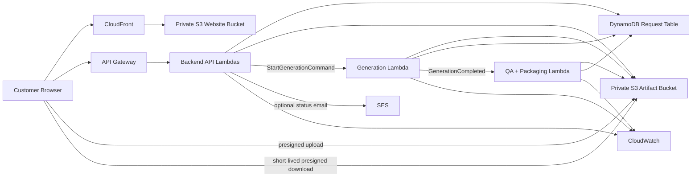

# AI Artist M1 LLD-05: AWS Runtime, Privacy/Security, Observability, Retention, and Demo Verification Fixtures

## Document Control

| Field | Value |
| --- | --- |
| LLD | LLD-05 |
| Product milestone | M1: `Memory Product Pack Agent` |
| Primary source | [M1 HLD](../hld/milestone-1-high-level-design.md) |
| Status | Reviewer reconfirmed signoff |
| Scope owner | AWS runtime, storage prefix authority, privacy/security, observability, retention, and demo verification |

## Purpose

LLD-05 defines the M1 runtime and operational foundation for the website-integrated automated generation flow.

LLD-05 is the authority for the runtime S3 prefix contract.

## In Scope

- AWS service topology.
- Runtime configuration.
- Private storage model.
- Canonical S3 prefix contract.
- Request-link privacy/security posture.
- Presigned upload and download constraints.
- IAM boundaries.
- Encryption.
- Structured logs, metrics, alarms, and dashboards.
- Retention and cleanup policy.
- Demo fixtures and verification plan.

## Out Of Scope

- Website UX details.
- Field-level request schema.
- Full `project.json` ownership.
- Generation provider implementation.
- QA gate implementation details.
- ZIP packaging internals.
- Marketplace, payment, POD, NFT, public gallery, account system, or operator review.

## Runtime Topology



M1 baseline:

- `CloudFront + S3` for the static website.
- `API Gateway + Lambda` for customer-facing APIs.
- `DynamoDB` for request metadata.
- Private S3 bucket for source uploads, generated artifacts, internal artifacts, QA reports, package manifest, and final ZIP.
- Lambda async invocation initially for generation and QA/package handoffs.
- `SQS` if queue backpressure or visibility timeout control is needed.
- `Step Functions` if multi-step resumability or long-running coordination is needed.
- Optional `SES` for status-link emails only.
- `CloudWatch` for logs, metrics, alarms, and operational traces.

## Canonical Prefix Authority

LLD-05 owns the M1 runtime S3 prefix contract.

Canonical attempt prefix:

```text
requests/{request_id}/generations/v{generation_version}/attempts/{attempt_id}/
```

Only these child directories are canonical:

```text
customer/
internal/
qa/
package/
```

Required canonical artifact paths:

```text
requests/{request_id}/generations/v{generation_version}/attempts/{attempt_id}/customer/sticker_sheet.png
requests/{request_id}/generations/v{generation_version}/attempts/{attempt_id}/customer/sticker_sheet.pdf
requests/{request_id}/generations/v{generation_version}/attempts/{attempt_id}/customer/postcard.png
requests/{request_id}/generations/v{generation_version}/attempts/{attempt_id}/customer/postcard.pdf
requests/{request_id}/generations/v{generation_version}/attempts/{attempt_id}/customer/poster.png
requests/{request_id}/generations/v{generation_version}/attempts/{attempt_id}/customer/poster.pdf
requests/{request_id}/generations/v{generation_version}/attempts/{attempt_id}/customer/social_preview.png
requests/{request_id}/generations/v{generation_version}/attempts/{attempt_id}/internal/generation_manifest.json
requests/{request_id}/generations/v{generation_version}/attempts/{attempt_id}/internal/prompt_log.json
requests/{request_id}/generations/v{generation_version}/attempts/{attempt_id}/internal/generation_notes.md
requests/{request_id}/generations/v{generation_version}/attempts/{attempt_id}/internal/style_recipe.json
requests/{request_id}/generations/v{generation_version}/attempts/{attempt_id}/internal/layout_plan.json
requests/{request_id}/generations/v{generation_version}/attempts/{attempt_id}/qa/quality_report.json
requests/{request_id}/generations/v{generation_version}/attempts/{attempt_id}/package/manifest.json
requests/{request_id}/generations/v{generation_version}/attempts/{attempt_id}/package/final_download_pack.zip
```

Broader private request layout:

```text
requests/{request_id}/
  uploads/
    {asset_id}.{normalized_ext}
  project/
    project_v{generation_version}.json
    rights_checklist.json
  generations/
    v{generation_version}/
      attempts/
        {attempt_id}/
          customer/
          internal/
          qa/
          package/
```

The following are incompatible with M1:

```text
requests/{request_id}/generated/attempt-{attempt_id}/...
requests/{request_id}/qa/attempt-{attempt_id}/...
requests/{request_id}/deliverables/attempt-{attempt_id}/...
```

## Attempt Freshness

`latest_eligible_attempt_id` is the runtime freshness authority for QA, packaging, delivery, cleanup decisions, logs, metrics, and stale-attempt rejection.

QA/package must reject work unless:

```text
request.latest_eligible_attempt_id == event.attempt_id
request.generation_version == event.generation_version
```

Stale callbacks must:

- Not package.
- Not write delivery metadata.
- Not issue customer download links.
- Emit stale-attempt metrics.
- Leave private stale artifacts for retention cleanup.

## Storage Privacy

Use separate logical storage surfaces:

| Bucket | Exposure | Contents |
| --- | --- | --- |
| Website bucket | CloudFront OAC only | Static frontend bundle and public demo-safe assets. |
| Private artifact bucket | No public access | Uploads, `project.json`, generated artifacts, internal artifacts, QA reports, package manifests, and final ZIPs. |

All buckets require:

- S3 Block Public Access.
- ACLs disabled.
- TLS-only bucket policy.
- Default server-side encryption.
- No public object ACLs.
- No public website hosting for private artifacts.

## Request-Link Security

M1 uses request links as bearer access credentials.

Approved link:

```text
https://app.example.com/request/{request_id}#access_token={request_access_token}
```

Approved API transport:

```http
Authorization: Bearer <request_access_token>
```

Prohibited:

- Token in query string.
- Token in URL path.
- Token in cookies.
- Token in `localStorage`.
- Token in analytics.
- Token in logs.

Frontend storage:

- Prefer memory.
- `sessionStorage` is acceptable only for page refresh.
- `localStorage` is prohibited.

API responses for request/status/delivery must use:

```text
Cache-Control: no-store
Referrer-Policy: no-referrer
```

Request/status/delivery routes must not load analytics pixels, tag managers, chat widgets, external fonts, or third-party scripts in M1.

## Presigned Uploads

Rules:

- Backend creates server-owned upload keys.
- Browser uploads directly to private S3.
- Use presigned POST where possible.
- Default TTL: 15 minutes.
- CORS limited to approved website origins.
- One upload URL per asset.
- Keys stay under the LLD-02/05-owned request upload area.
- Upload metadata must not include raw email, private notes, or unnecessary PII.

## Presigned Downloads

Download flow:

1. Website calls status/download API with request token in `Authorization`.
2. Backend verifies delivered state and latest eligible delivered attempt.
3. Backend issues a short-lived download URL for:

```text
requests/{request_id}/generations/v{generation_version}/attempts/{attempt_id}/package/final_download_pack.zip
```

Rules:

- Default TTL: 15 minutes.
- Do not email raw presigned download URLs.
- Do not issue customer download URLs for source photos or internal artifacts.
- Expired links are refreshed through the API.

## IAM Boundaries

| Principal | Allowed access |
| --- | --- |
| CloudFront OAC | Read website bucket only. |
| Backend API Lambda | Request table access, upload/download URL creation, `project.json`, attempt metadata, generation trigger. |
| Generation Lambda | Read `project.json` and source uploads; write only `customer/` and `internal/` for its attempt. |
| QA/Packaging Lambda | Read generation artifacts; write only `qa/` and `package/` for its attempt. |
| Optional SES sender | Send approved status-link emails only. |
| Cleanup process | Delete or expire objects based on request/attempt retention policy. |

Provider secrets are readable only by the generation worker.

## Configuration

Frontend-safe config:

| Config | Purpose |
| --- | --- |
| `AI_ARTIST_STAGE` | Display/environment routing. |
| `AI_ARTIST_API_BASE_URL` | Backend API base URL. |
| `AI_ARTIST_MAX_PHOTOS` | UI validation mirror. |
| `AI_ARTIST_PUBLIC_ASSET_BASE_URL` | Public demo/style assets. |

Backend config:

| Config | Purpose |
| --- | --- |
| `AI_ARTIST_PRIVATE_BUCKET` | Private artifact bucket. |
| `AI_ARTIST_REQUEST_TABLE` | DynamoDB table. |
| `AI_ARTIST_UPLOAD_URL_TTL_SECONDS` | Upload URL TTL. |
| `AI_ARTIST_DOWNLOAD_URL_TTL_SECONDS` | Download URL TTL. |
| `AI_ARTIST_GENERATION_MODE` | `fake` or `provider`. |
| `AI_ARTIST_CANONICAL_PREFIX_VERSION` | Recommended `m1.attempt_prefix.v1`. |
| `AI_ARTIST_RETENTION_PROFILE` | `local`, `dev`, `demo`, or `prod`. |
| `AI_ARTIST_SES_ENABLED` | Enables optional email notifications. |
| `LOG_LEVEL` | Structured log verbosity. |

Secrets must live in environment variables or AWS Secrets Manager, never frontend code, S3 artifacts, logs, or committed files.

## Observability

Structured logs should include safe fields:

- `request_id`
- `generation_version`
- `attempt_id`
- `latest_eligible_attempt_id`
- `canonical_prefix_version`
- `component`
- `status_from`
- `status_to`
- `reason_code`
- `failure_category`
- `duration_ms`
- `trace_id`

Logs must not include:

- Raw uploaded photos.
- Signed URLs.
- Request access tokens.
- API keys or secrets.
- Raw customer email.
- Raw private notes where avoidable.
- Full rendered prompts containing customer-sensitive text.

Minimum metrics:

- `RequestCreatedCount`
- `AttemptCreatedCount`
- `GenerationStartedCount`
- `GenerationSucceededCount`
- `GenerationFailedCount`
- `QaStartedCount`
- `QaPassedCount`
- `QaFailedCount`
- `PackagingSucceededCount`
- `PackagingFailedCount`
- `DeliveryReadyCount`
- `DownloadLinkCreatedCount`
- `DownloadLinkFailedCount`
- `StaleAttemptCallbackCount`
- `CanonicalPrefixViolationCount`
- `RetentionCleanupFailedCount`

Minimum demo alarms:

- API Gateway 5xx.
- Lambda errors and throttles.
- Generation failures.
- QA/package failures.
- Requests stuck in `generating`, `qa_checking`, or `packaging`.
- Any stale attempt callback.
- Any canonical prefix violation.
- Download-link creation failures.
- DynamoDB throttling.
- Retention cleanup failures.

## Retention

Recommended M1 defaults:

| Data class | Default |
| --- | --- |
| Unsubmitted uploads | Delete after 24 hours. |
| Source uploads after terminal state | Delete after 7 days. |
| Superseded/stale attempt artifacts | Delete after 7 days unless needed for debugging. |
| Generated customer artifacts | Keep 30 days after delivery, then delete or archive. |
| Final ZIP | Keep 30 days after delivery, then delete or archive. |
| Internal manifests and QA reports | Keep up to 90 days if sanitized. |
| Prompt logs and generation notes | Keep 30 days unless sanitized and approved longer. |
| Request metadata | Keep 90 days after terminal state, then minimize or delete. |
| CloudWatch logs | 30 days for `dev`/`demo`; 90 days for future `prod` after review. |

Cleanup must never delete active latest attempts in `submitted`, `validating`, `generating`, `qa_checking`, or `packaging`.

## Demo Verification Fixtures

Use fake, owned, licensed, public-domain, or generated-safe assets. Do not commit private customer photos.

Required fixture coverage:

- Happy path with 1 photo.
- Happy path with 5 photos.
- `needs_customer_input` amendable case.
- `needs_customer_input` non-amendable case.
- `blocked` rights/scope case.
- `failed` generation or QA case.
- Stale attempt rejected.
- Incompatible prefix rejected.

End-to-end demo checks:

1. Upload fixture assets.
2. Submit request.
3. Confirm LLD-02 creates `attempt_id`.
4. Confirm generation writes customer/internal refs under canonical prefix.
5. Confirm `internal/generation_manifest.json`.
6. Confirm QA writes `qa/quality_report.json`.
7. Confirm packaging writes `package/manifest.json`.
8. Confirm final ZIP at `package/final_download_pack.zip`.
9. Confirm ZIP contains exactly the M1 customer files.
10. Confirm ZIP excludes internal and source artifacts.
11. Confirm stale attempt does not deliver.
12. Confirm logs do not expose tokens, signed URLs, source photos, secrets, or private notes.

## Acceptance Checks

- Runtime uses CloudFront/S3, API Gateway/Lambda, DynamoDB, private S3, optional SES, and CloudWatch.
- LLD-05 is explicit canonical prefix authority.
- Only `customer/`, `internal/`, `qa/`, and `package/` are canonical attempt child directories.
- `attempt_id`, `generation_version`, and `latest_eligible_attempt_id` are present in runtime flow.
- LLD-03 writes `internal/generation_manifest.json`.
- LLD-04 writes `qa/quality_report.json`, `package/manifest.json`, and `package/final_download_pack.zip`.
- Request tokens use URL fragment plus `Authorization: Bearer`.
- Upload and download URLs are short-lived.
- Logs redact tokens, signed URL signatures, customer email, and secrets.
- Retention rules exist before demo or wider testing.
- Demo fixtures cover happy path, failed, blocked, needs-input, stale-attempt, and incompatible-prefix cases.
- No Cognito/accounts, payment, marketplace, POD, NFT, public gallery, or operator gate is introduced.

## Open Questions

- AWS region and domain for demo.
- Whether demo uses SSE-S3 or SSE-KMS before real tester uploads.
- Whether SES email is enabled for demo.
- Exact request token lifetime relative to deliverable retention.
- Whether WAF is needed for demo or deferred.
- Final manual inspection policy before broader launch.
