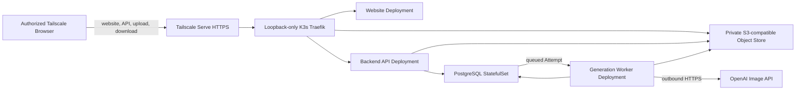

# AI Artist M1 LLD-05: Home Kubernetes Runtime, Storage, Security, and Attempt Queue

## Document Control

| Field | Value |
| --- | --- |
| LLD | LLD-05 |
| Product milestone | M1: Memory Product Pack Agent |
| Primary source | [M1 HLD](../hld/milestone-1-high-level-design.md) |
| Status | Implementation-ready; home deployment profile finalized |
| Scope owner | Home Kubernetes runtime, Tailscale access boundary, private storage, queued-Attempt delivery, OpenAI access, and retention |

## Purpose

LLD-05 defines the minimum Phase 1 runtime and security posture for the M1 `Task` -> `Attempt` -> postcard artifact workflow.

Phase 1 runs on a home Linux server with a single-node K3s cluster. The complete customer workflow is available only to authorized devices in the owner's Tailscale tailnet. LAN devices use the same Tailscale URL rather than a separate LAN ingress. The Generation Worker calls the OpenAI Image API over outbound HTTPS using a server-side API key; the home server does not run an AI model.

Initial integration verification runs directly on this Linux K3s runtime with the deterministic fake provider. Provider-cost and credential-dependent checks begin only after the real Website, API, PostgreSQL, MinIO, Worker, artifact, and download flow passes through the tailnet origin.

AWS remains a possible later deployment target. M1 domain contracts must therefore stay independent of Kubernetes, PostgreSQL, MinIO, and AWS-specific SDK types.

## In Scope

- Single-node K3s runtime on the approved home Linux server.
- Tailnet-only website, API, and object upload/download access through Tailscale Serve.
- One canonical MagicDNS hostname and automatically managed tailnet HTTPS.
- Website, Backend API, and Generation Worker Deployments.
- PostgreSQL Task/Asset/Attempt/Artifact metadata and durable queued Attempts.
- Private S3-compatible object storage, with MinIO as the default Phase 1 implementation.
- Short-lived upload/download constraints.
- Kubernetes Secret handling for `OPENAI_API_KEY`.
- Basic container logging and failed-Attempt visibility.
- Attempt retention with no automatic cleanup.
- Minimum persistence and backup posture for private photos and generated artifacts.

## Out Of Scope

- Public Internet ingress, Tailscale Funnel, public DNS, router port forwarding, UPnP exposure, or other public tunnels.
- A second direct-LAN URL, private LAN CA, or unauthenticated LAN ingress.
- Multi-node Kubernetes, high availability, zero-downtime maintenance, or automatic failover.
- Local OpenAI, Claude, or other foundation-model inference.
- AWS runtime resources or AWS data migration.
- Accounts, payments, marketplace, POD, NFT, rights, or operator workflows.
- ZIP packaging, PDF output, multi-artifact delivery, and automated visual QA.
- Complex dashboards, distributed tracing, or an alert taxonomy.

## Runtime Topology



Phase 1 components are:

| Component | Kubernetes shape | Responsibility |
| --- | --- | --- |
| Tailscale Serve | Host service, one persistent background configuration | Terminate tailnet HTTPS and proxy the canonical hostname to the loopback-only K3s ingress. |
| K3s Traefik | Bundled controller with loopback-only `NodePort 30080` | Route website, `/v1` API, and path-style private-bucket requests without binding host ports 80 or 443. |
| Website | `Deployment` + `Service`, one replica | Serve the static frontend and browser-safe runtime configuration. |
| Backend API | `Deployment` + `Service`, one replica | Own customer APIs, metadata validation, object links, and queued Attempt creation. |
| PostgreSQL | `StatefulSet` + `PersistentVolumeClaim`, one replica | Store the four normative tables; queued Attempt rows are the durable work queue. |
| Object store | MinIO or compatible `StatefulSet` + `PersistentVolumeClaim`, one replica | Store source uploads and postcard artifacts. |
| Generation Worker | `Deployment`, one replica | Claim queued Attempts, call the configured external provider, verify output, and finalize Attempt state. |

All workloads run in one `ai-artist` namespace. Phase 1 assumes planned downtime during node, cluster, database, object-store, or application maintenance.

## Initial Linux Server Verification

The first native K3s deployment uses `AI_ARTIST_GENERATION_PROVIDER=fake`, `demoMode=false`, generated in-cluster PostgreSQL/MinIO credentials, and the full home storage and access topology. It must pass the real Browser -> API -> PostgreSQL/MinIO -> Worker -> Artifact -> download flow before the OpenAI provider is enabled. There is no parallel local-cluster profile or disposable local storage contract.

## Tailscale Access Boundary

The default Task route is:

```text
https://tongjin-server.tail910d5f.ts.net/tasks/{task_id}
```

Deployment rules:

- `tongjin-server.tail910d5f.ts.net` is the one canonical customer hostname for home and remote use.
- Tailscale MagicDNS and HTTPS must be enabled. Tailscale Serve runs persistently in background mode and proxies HTTPS to `http://127.0.0.1:30080`.
- The owner accepts that enabling tailnet HTTPS publishes the MagicDNS machine name in Certificate Transparency; it does not make the service publicly reachable.
- Tailscale Funnel must remain disabled. The home router must not forward AI Artist ports, and K3s must not create a public or LAN `LoadBalancer` service.
- K3s ServiceLB is disabled. The bundled Traefik Service is `NodePort 30080`, and K3s passes `nodeport-addresses=127.0.0.0/8` to kube-proxy so the NodePort is reachable only through loopback.
- The fixed NodePort restriction assumes kube-proxy `iptables` mode; changing proxy mode requires an access-boundary revalidation.
- Authorized clients must run Tailscale. A device with ordinary LAN access but no approved tailnet membership cannot use AI Artist.
- Tailnet policy permits HTTPS access to this node only from approved owner devices. The application does not treat Tailscale identity headers as customer API credentials.
- Tailscale Serve and Traefik must preserve the original hostname and path. Traefik routes `/v1` to the Backend API, `/ai-artist-private` to the MinIO S3 data endpoint, and all other customer paths to the Website.
- The private bucket uses S3 path-style URLs so presigned upload/download requests use the same canonical hostname and pass through the same tailnet boundary.
- The object-store administration console remains cluster-internal and has no Traefik route.
- The existing Nextcloud snap keeps host port 80. AI Artist does not bind host port 80 and does not change the Nextcloud service.

## Metadata And Durable Attempt Queue

PostgreSQL stores exactly the four normative LLD-02 tables: `tasks`, `assets`, `attempts`, and `artifacts`. Domain repositories hide SQL details from LLD-01 and LLD-03. M1 has no `generation_jobs` table or command/outbox record.

Attempt creation occurs in one database transaction:

1. LLD-02 locks the Task and validates that it has no Attempt in `queued` or `generating`.
2. LLD-02 inserts the immutable Attempt with status `queued` and fixed provider/model.
3. LLD-02 updates `tasks.current_attempt_id` to the new Attempt.
4. The transaction commits both writes or neither write.

The Worker claims the oldest queued Attempt with:

```sql
SELECT attempt_id
FROM attempts
WHERE status = 'queued'
ORDER BY created_at, attempt_id
FOR UPDATE SKIP LOCKED
LIMIT 1;
```

In the same transaction, it conditionally changes `queued -> generating`, creates an unguessable `lease_token`, sets `started_at`, and sets `lease_expires_at` to 10 minutes after claim.

Attempt delivery rules:

- The provider call timeout is 8 minutes, shorter than the 10-minute Attempt lease.
- M1 makes at most one provider call per Attempt and never changes a failed or expired Attempt back to `queued`.
- Provider, storage, normalization, or verification failure moves the claimed Attempt to `failed` with a customer-safe `failure_code`.
- A Worker startup sweep and 60-second periodic sweep mark expired `generating` Attempts `failed`; they clear lease fields and never requeue the Attempt.
- Ready finalization requires status `generating`, the matching `lease_token`, and an unexpired lease. It inserts the Artifact and changes the Attempt to `ready` in one PostgreSQL transaction.
- If the provider returns after lease expiry or terminal failure, the conditional update fails and the Worker discards the response.
- There is no delivery-count, retry-count, next-retry, job ID, or command JSON field in M1.

## Private Object Storage

LLD-05 owns this logical layout:

```text
tasks/{task_id}/
  uploads/
    {asset_id}.{normalized_ext}
  attempts/
    {attempt_id}/
      postcard.png
```

Rules:

- The immutable Attempt input snapshot lives only in PostgreSQL `attempts.input_snapshot`.
- `postcard.png` is the only M1 customer artifact.
- The browser never chooses object keys.
- The object store is not anonymously readable or listable.
- Source uploads and artifacts live on a persistent volume outside container filesystems.
- Presigned upload and download URLs default to a 15-minute TTL.
- Presigned URLs use the canonical Tailscale HTTPS endpoint and path-style bucket addressing; they are never stored in PostgreSQL. Each Asset stores only the matching `upload_url_expires_at` timestamp.
- The Backend API verifies stored media type and size before marking an Asset `uploaded`.
- Never issue customer download URLs for source photos.
- Never return internal object keys through customer APIs.

MinIO is the default Phase 1 implementation because it provides the required S3-compatible object API. Application code depends on an `ObjectStore` boundary rather than MinIO-specific admin APIs so the storage implementation can change later.

## External AI Provider Boundary

Provider-specific calls remain behind the LLD-03 `GenerationProvider` interface.

Phase 1 rules:

- `AI_ARTIST_GENERATION_PROVIDER` selects `openai` or `fake`.
- `openai` calls the OpenAI Image API over outbound HTTPS using the fixed LLD-03 request contract.
- The official OpenAI Python client is configured with `max_retries=0`; the Worker, HTTP transport, Ingress, and service mesh do not retry provider calls.
- `fake` is allowed for deterministic local tests and smoke verification, not as the normal household generation mode.
- The production model is fixed to `gpt-image-2-2026-04-21`; Anthropic and other adapters are deferred.
- The home Kubernetes cluster does not download or serve foundation-model weights.
- Source photos, title, note, style, and refinement content may leave the home network when sent to the selected provider. The UI or operator documentation must make that boundary clear before non-fixture use.
- Provider responses still pass LLD-03 minimum output verification before an Attempt becomes `ready`.

The server requires outbound DNS and HTTPS access to the selected provider. No inbound connection from the provider is required.

## Phase 1 Application Access

Rules:

- Phase 1 has no application-layer account, login, Task token, or `Authorization` header.
- Any device permitted by the tailnet policy can call the customer API and open a known Task route.
- Any device permitted by the tailnet policy can list every Task summary through the system-level `GET /v1/tasks` endpoint; the tailnet must therefore remain a trusted single-household boundary.
- `task_id` is a resource identifier, not an authorization credential.
- Task collection, Task detail, status, and download responses use `Cache-Control: no-store` and `Referrer-Policy: no-referrer`.
- M1 Task routes load no analytics pixels, tag managers, chat widgets, external fonts, or unnecessary third-party scripts.
- Authentication and authorization must be designed before any public Internet or future AWS-facing exposure.

The Tailscale network boundary is an explicit Phase 1 simplification. It does not replace upload validation, private object storage, provider-secret handling, or log redaction. Application authentication and authorization remain required before any future public or non-tailnet exposure.

## Secrets And Workload Boundaries

API keys are created directly in the cluster as Kubernetes Secrets or supplied through an equivalent local secret-management workflow.

Rules:

- Never commit API keys, `.env` files, or Secret manifests containing real values.
- The Website Deployment receives no provider API key.
- The Backend API does not need provider API keys unless a later contract explicitly requires it.
- Only the Generation Worker receives `OPENAI_API_KEY`.
- Kubernetes Secret values are sensitive even though their manifest encoding may be base64; restrict namespace RBAC and host access accordingly.
- Logs must not include keys, presigned URLs, raw photos, full prompts, or unnecessary private notes.

Minimum workload access:

| Workload | Allowed access |
| --- | --- |
| Website | Browser-safe runtime config only; no database, object-store credentials, or AI-provider secrets. |
| Backend API | Task metadata, upload/download URL creation, and queued Attempt creation. |
| Generation Worker | Read Attempt inputs/source uploads, call the selected provider, write the current Attempt output, and update the current Attempt. |
| PostgreSQL | Cluster-internal access from Backend API and Generation Worker only. |
| Object store | Cluster-internal service plus tailnet-only presigned data access through Traefik; admin console remains internal. |

The Generation Worker must not issue customer download URLs or modify unrelated Tasks.

## Configuration

Browser-safe configuration:

| Config | Purpose |
| --- | --- |
| AI_ARTIST_STAGE | Runtime stage, initially `home`. |
| AI_ARTIST_PUBLIC_BASE_URL | Fixed at `https://tongjin-server.tail910d5f.ts.net`. |
| AI_ARTIST_API_BASE_URL | Fixed at `https://tongjin-server.tail910d5f.ts.net`; customer routes retain their `/v1` prefix. |
| AI_ARTIST_ASSET_BASE_URL | Fixed at the canonical Tailscale HTTPS origin. |
| AI_ARTIST_MAX_PHOTOS | Fixed at 5 for M1. |

Backend and storage configuration:

| Config | Purpose |
| --- | --- |
| AI_ARTIST_DATABASE_URL | PostgreSQL connection string supplied as a Secret. |
| AI_ARTIST_OBJECT_ENDPOINT | Cluster-internal S3-compatible endpoint. |
| AI_ARTIST_OBJECT_PRESIGN_ENDPOINT | Fixed at `https://tongjin-server.tail910d5f.ts.net`; presigned URLs use path-style bucket addressing. |
| AI_ARTIST_OBJECT_ADDRESSING_STYLE | Fixed at `path`; virtual-hosted bucket addressing is not used. |
| AI_ARTIST_PRIVATE_BUCKET | Fixed at `ai-artist-private`. |
| AI_ARTIST_UPLOAD_URL_TTL_SECONDS | Fixed at 900 seconds by default. |
| AI_ARTIST_DOWNLOAD_URL_TTL_SECONDS | Fixed at 900 seconds by default. |
| AI_ARTIST_ATTEMPT_LEASE_SECONDS | Fixed at 600 seconds for M1. |
| AI_ARTIST_ATTEMPT_RECONCILE_INTERVAL_SECONDS | Fixed at 60 seconds for M1. |

Generation Worker configuration:

| Config | Purpose |
| --- | --- |
| AI_ARTIST_GENERATION_PROVIDER | `openai` for household generation or `fake` for deterministic tests. |
| AI_ARTIST_OPENAI_IMAGE_MODEL | Fixed at `gpt-image-2-2026-04-21`. |
| AI_ARTIST_OPENAI_IMAGE_QUALITY | Fixed at `medium`. |
| AI_ARTIST_OPENAI_PROVIDER_SIZE | Fixed at `1808x1200`; LLD-03 center-crops to `1800x1200`. |
| AI_ARTIST_PROVIDER_TIMEOUT_SECONDS | Fixed at 480 seconds for M1. |
| OPENAI_API_KEY | OpenAI credential, supplied only to the Generation Worker when `openai` is selected. |
| LOG_LEVEL | Basic log verbosity. |

## Minimum Observability

Keep only:

- Backend API and Generation Worker container logs.
- PostgreSQL queued/generating/failed Attempt counts and expired-lease queries.
- Kubernetes Pod restart and readiness state.
- `tailscale serve status` and a check that Tailscale Funnel is disabled.
- Generation failure logs with `task_id`, `attempt_id`, safe failure category, and provider correlation ID when available.

`kubectl logs`, Kubernetes events, and narrow database queries are sufficient for Phase 1. Prometheus, Grafana, Loki, tracing, and external alerting are deferred.

## Persistence, Backup, And Retention

Phase 1 has no HA. PostgreSQL and object storage use one replica and `ReadWriteOnce` persistent volumes on the home server. The server and its primary disks remain a single failure domain.

The finalized server and storage profile is:

| Surface | Phase 1 value |
| --- | --- |
| Host | `tongjin-server`, Ubuntu 24.04.4 LTS, `x86_64` |
| Capacity | 8 logical CPUs and 15 GiB RAM |
| K3s system storage | Existing NVMe root filesystem under the K3s default data path |
| Application StorageClass path | `/data/ai-artist/k3s-storage` on the 1 TB SSD |
| PostgreSQL PVC request | 20 GiB, one replica |
| MinIO PVC request | 500 GiB, one replica; local-path capacity is monitored at filesystem level |
| Backup target | `/backup/ai-artist` on the separate 2 TB HDD |
| LAN identity | Current address `192.168.4.26`; router DHCP reservation is required before deployment. Wi-Fi is accepted for M1, while wired Ethernet remains recommended. |
| Tailnet identity | `tongjin-server.tail910d5f.ts.net`, currently `100.90.10.70` |

Phase 1 application images are built on the x86_64 server from a named Git commit with the existing Docker installation, exported as image archives, and imported into K3s containerd. Deployments use immutable commit-derived tags with `imagePullPolicy: IfNotPresent`. A private registry and automated release pipeline are deferred.

The `ai-artist-local-path` StorageClass uses `rancher.io/local-path` with `nodePath: /data/ai-artist/k3s-storage`, and both StatefulSets explicitly set `storageClassName`. The deployment preflight requires K3s `default-local-storage-path` to match, verifies `/data` is not the root filesystem, and checks every bound PV's reported `hostPath` or `local` path before declaring deployment successful. It refuses to mutate or delete legacy PVCs automatically.

Before using irreplaceable household photos:

- Keep the original photos outside AI Artist.
- Back up PostgreSQL and the private object-store data to a separate disk or another non-cluster location.
- Verify at least one restore procedure before treating the system as durable storage.

M1 does not implement application-data cleanup, archive tiers, or automatic disaster recovery. Task metadata, failed Attempts, private photos, and Artifacts remain until a later explicit cleanup workflow exists. Absence of HA does not remove the need to protect private photos or API keys.

## Future AWS Deployment

AWS may become a later runtime target when public access, managed durability, horizontal scaling, or higher availability is needed. It is not part of Phase 1.

A future AWS implementation may replace runtime adapters with managed services, but it must preserve:

- Customer API paths and payloads.
- `Task`, `Asset`, `Attempt`, and `Artifact` identities and status rules.
- The immutable `attempts.input_snapshot` contract and object-key layout.
- Queued-Attempt single-delivery and terminal-failure semantics.
- The `GenerationProvider` boundary.
- Privacy, private-storage, and log-redaction rules. Authentication and authorization are a required new boundary before public exposure.

Kubernetes resource names, PostgreSQL row IDs, MinIO-specific APIs, AWS ARNs, SQS receipt handles, and Lambda invocation IDs must not appear in domain or customer contracts.

## Acceptance Checks

- The website, `/v1` API, and path-style presigned upload/download URLs work through `https://tongjin-server.tail910d5f.ts.net` from an authorized tailnet device.
- A LAN-only device without approved Tailscale access cannot reach the application.
- Tailscale Serve is persistent, Tailscale Funnel is disabled, and no router port forwarding or Internet-facing load balancer is required.
- K3s ServiceLB is disabled; Traefik `NodePort 30080` is reachable through loopback but not through the LAN or Tailscale node address.
- Existing Nextcloud access on host port 80 remains unchanged.
- Website, Backend API, Generation Worker, PostgreSQL, and object storage run on a single Kubernetes node with one replica each.
- PostgreSQL atomically persists each queued Attempt and updates `tasks.current_attempt_id`; no generation-job table exists.
- Each Attempt receives at most one claim and one provider call.
- The OpenAI SDK and surrounding transport are configured for zero provider-call retries.
- Lease expiry marks the Attempt failed without requeue, and conditional finalization rejects late Worker responses.
- Failed Attempts remain inspectable with no automatic cleanup.
- Private object storage uses persistent storage and does not allow anonymous reads or listing.
- PostgreSQL and MinIO PVCs use `ai-artist-local-path`, and their bound PV paths resolve below `/data/ai-artist/k3s-storage` on the dedicated SSD.
- Website, API, migration, and Worker Deployments reference the exact commit-derived image tag imported during the deployment.
- Upload/download URLs are short-lived, use the canonical Tailscale hostname, and pass a real presigned POST/GET end-to-end check through Tailscale Serve and Traefik.
- `OPENAI_API_KEY` exists only in a server-side Secret available to the Generation Worker and never reaches the browser or repository.
- AI generation uses outbound provider APIs; no foundation model runs on the home server.
- The UI or operator documentation makes the external-provider data boundary clear before non-fixture use.
- Logs do not expose secrets, signed URLs, raw photos, full prompts, or unnecessary private content.
- Node restarts and planned downtime are accepted; HA and automatic failover are not required.
- The application contracts remain portable to a possible future AWS runtime.

## Deployment Parameters

The Kubernetes distribution, access hostname, access proxy, storage paths, initial PVC requests, backup target, and local image-delivery method are fixed above. The implementation pins an exact supported K3s patch version and immutable application-image tags when the scaffold is created. Secret values, including the OpenAI account credential and database/object-store passwords, remain deployment inputs and never enter the repository. The M1 provider/model request contract is fixed by LLD-03 and is not a free deployment choice.

Official references used to freeze this profile:

- [Tailscale Serve](https://tailscale.com/docs/features/tailscale-serve)
- [Tailscale HTTPS certificates](https://tailscale.com/docs/how-to/set-up-https-certificates)
- [Kubernetes NodePort address restriction](https://kubernetes.io/docs/concepts/services-networking/service/#custom-ip-address-configuration-for-type-nodeport-services)
- [K3s local image import](https://docs.k3s.io/add-ons/import-images)
